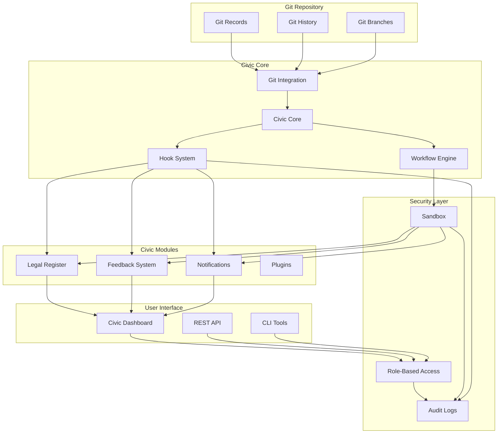
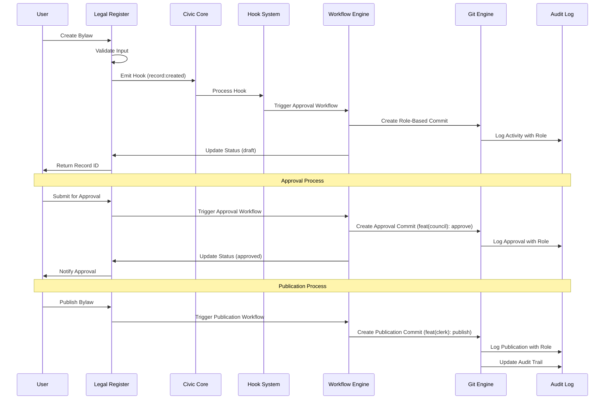
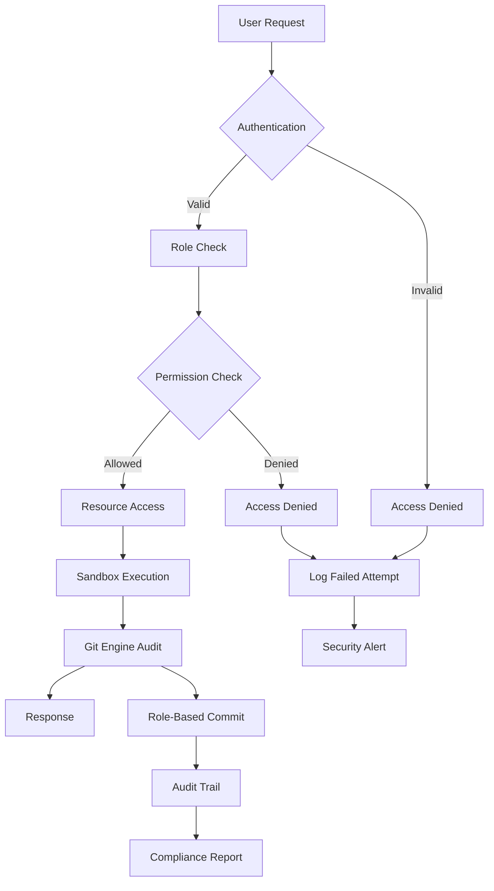
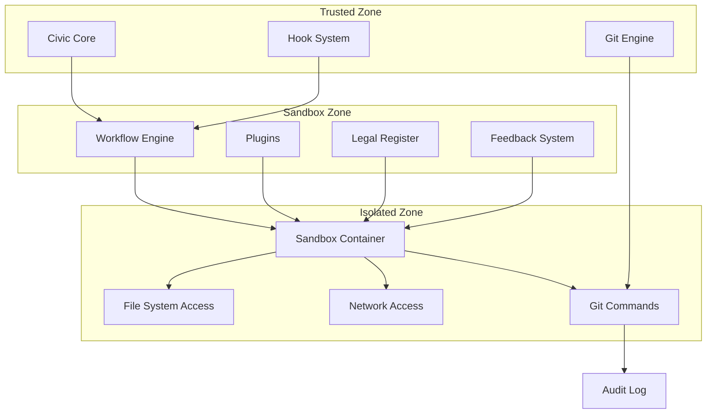
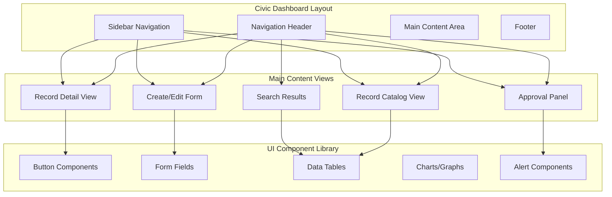
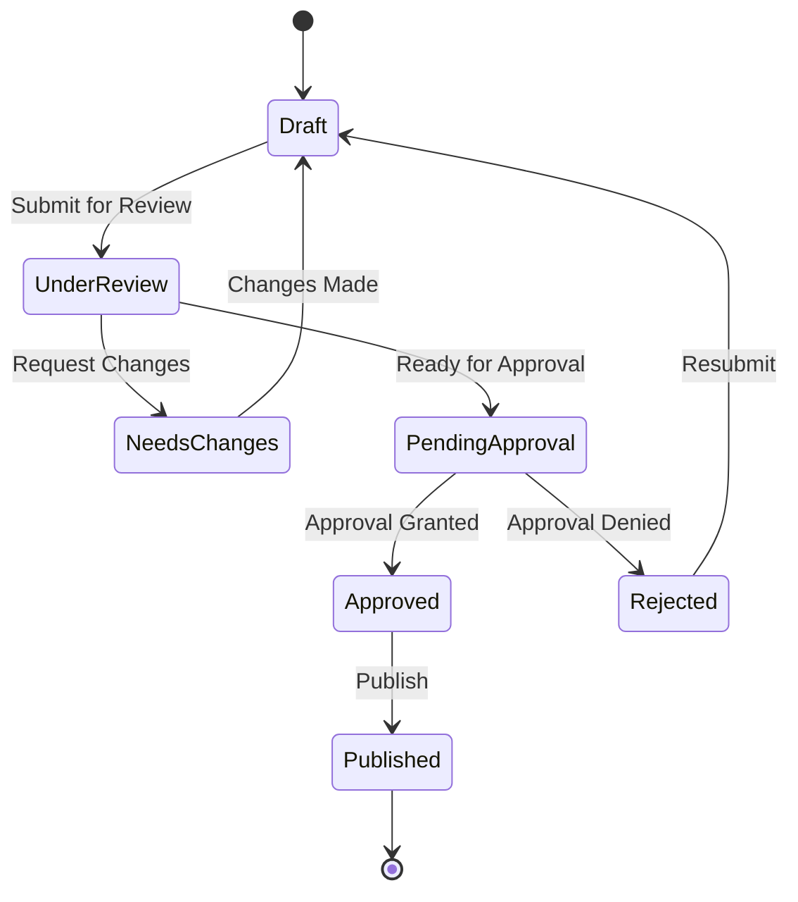
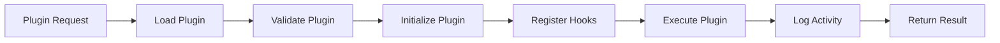
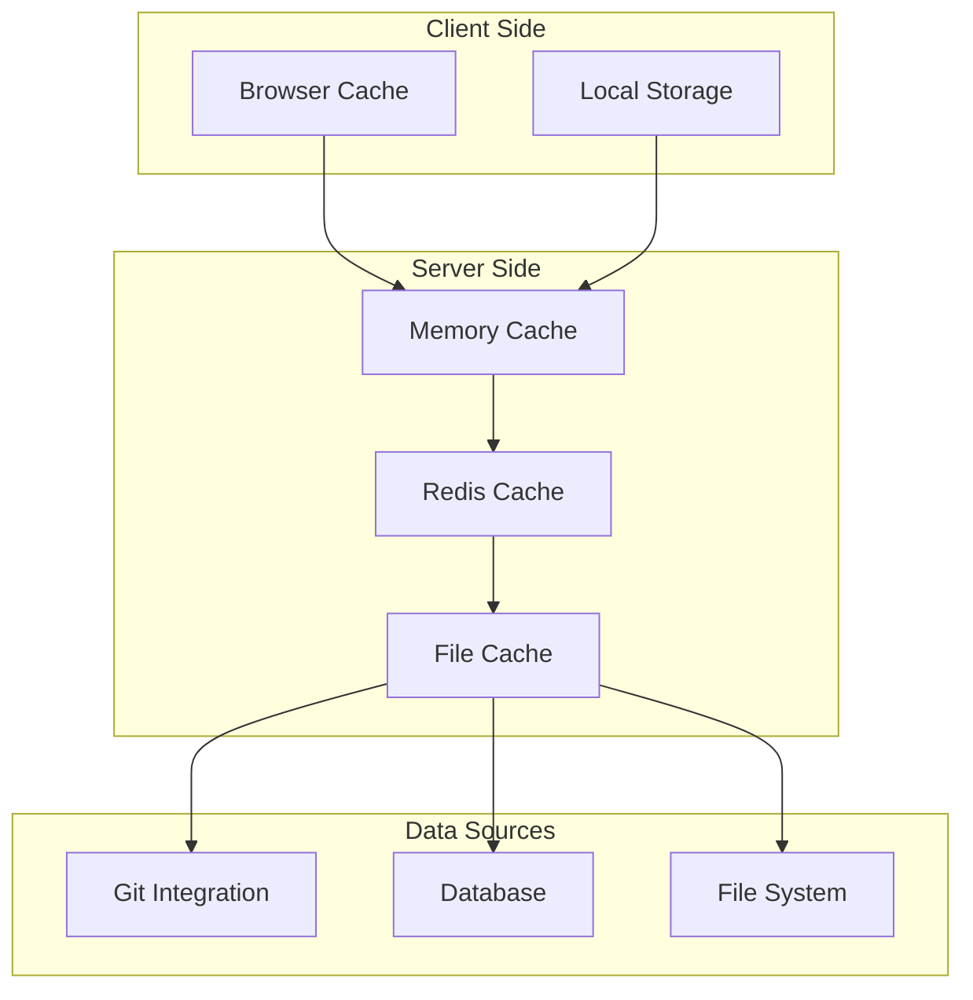
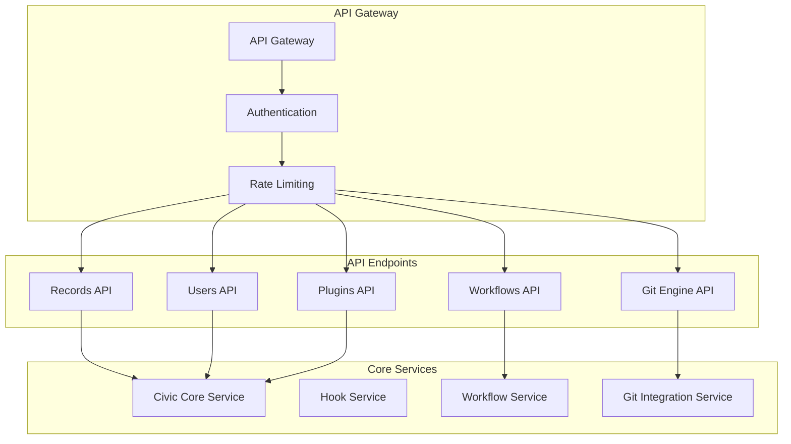
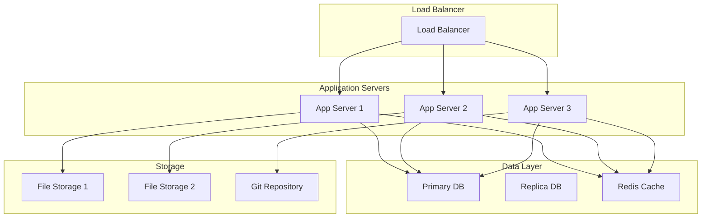

# 🏗️ CivicPress Architecture Diagrams

**Last Updated**: 2025-01-27  
**Diagram Type**: Mermaid  
**Purpose**: Visual representation of CivicPress architecture

## 🎯 **High-Level System Architecture**

### **Core Platform Overview**



## 🔄 **Data Flow Architecture**

### **Civic Record Lifecycle**

```mermaid
flowchart TD
    A[User Input] --> B{Validation}
    B -->|Valid| C[Create Record]
    B -->|Invalid| D[Return Error]

    C --> E[Git Engine Commit]
    E --> F[Role-Based Commit Message]
    F --> G[Hook Event: record:created]
    G --> H[Workflow Engine]

    H --> I{Record Type}
    I -->|Bylaw| J[Legal Register Workflow]
    I -->|Policy| K[Policy Workflow]
    I -->|Proposal| L[Proposal Workflow]

    J --> M[Approval Process]
    K --> M
    L --> M

    M --> N{Approved?}
    N -->|Yes| O[Git Engine: Publish Record]
    N -->|No| P[Git Engine: Return to Draft]

    O --> Q[Role-Based Commit: feat(clerk): publish]
    P --> R[Role-Based Commit: feat(council): reject]

    Q --> S[Hook Event: record:published]
    R --> T[Hook Event: record:rejected]

    S --> U[Notification System]
    T --> V[Notify Creator]

    U --> W[Public Dashboard]
    V --> X[Audit Log]
    W --> X
```

## 🧩 **Module Interaction Architecture**

### **Legal Register Module Flow**



## 🔐 **Security Architecture**

### **Access Control Flow**



### **Sandbox Security Model**



## 🎨 **User Interface Architecture**

### **Dashboard Component Structure**



## 🔄 **Workflow Architecture**

### **Approval Workflow**



### **Plugin Workflow**



## 📊 **Performance Architecture**

### **Caching Strategy**



## 🔗 **API Architecture**

### **REST API Structure**



## 🎯 **Deployment Architecture**

### **System Deployment**



## 📋 **Diagram Usage Guidelines**

### **When to Use Each Diagram**

- **High-Level System**: For understanding overall architecture
- **Data Flow**: For understanding how data moves through the system
- **Module Interaction**: For understanding component relationships
- **Security**: For understanding access control and security measures
- **User Interface**: For understanding UI component structure
- **Workflow**: For understanding business processes
- **Performance**: For understanding caching and optimization
- **API**: For understanding service communication
- **Deployment**: For understanding infrastructure

### **Maintenance**

- Update diagrams when architecture changes
- Keep diagrams synchronized with code
- Use diagrams in documentation and presentations
- Version control diagrams with code

## 🔗 **Related Documentation**

- **Specifications Index**: `.civic/specs-index.md`
- **Core Platform**: `.civic/specs/api.md`, `.civic/specs/hooks.md`,
  `.civic/specs/workflows.md`
- **Git Engine**: `.civic/specs/git-engine.md`
- **Legal Register**: `.civic/specs/legal-register.md`
- **Security**: `.civic/specs/security.md`, `.civic/specs/auth.md`,
  `.civic/specs/permissions.md`
- **UI/UX**: `.civic/specs/ui.md`, `.civic/specs/frontend.md`,
  `.civic/specs/accessibility.md`
- **Plugins**: `.civic/specs/plugins.md`, `.civic/specs/plugin-api.md`,
  `.civic/specs/plugin-development.md`
