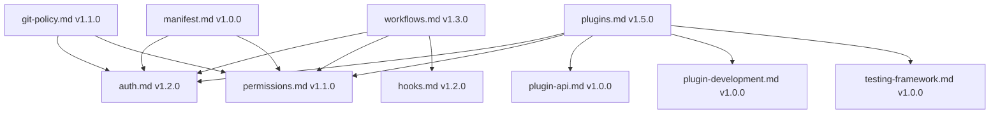
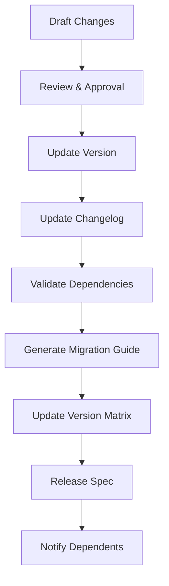

# 📋 CivicPress Spec: `spec-versioning.md`

---
version: 1.5.0
status: stable
created: '2025-07-04'
updated: '2025-07-15'
deprecated: false
sunset_date: null
authors:

- 'Sophie Germain <sophie@civic-press.org>'
reviewers:
- 'Ada Lovelace'
- 'Irène Joliot-Curie'

---

## 📛 Name

Specification Versioning & Change Management

## 🎯 Purpose

Establish a standardized versioning system for CivicPress specifications to
track changes, maintain backward compatibility, and ensure clear communication
of updates across the development team and community.

---

## 🧩 Scope & Responsibilities

✅ Responsibilities:

- Define versioning scheme and change classification
- Establish change tracking and documentation standards
- Provide migration guidance for breaking changes
- Ensure backward compatibility policies
- Create deprecation and sunsetting procedures

❌ Out of Scope:

- Implementation versioning (handled by semantic versioning)
- Third-party dependency versioning

---

## 🔢 Versioning Scheme

### Semantic Versioning for Specs

```
MAJOR.MINOR.PATCH[-PRERELEASE][+BUILD]
```

| Component      | Purpose                       | Example            | Breaking Change |
| -------------- | ----------------------------- | ------------------ | --------------- |
| **MAJOR**      | Incompatible changes          | `2.0.0`            | ✅ Yes          |
| **MINOR**      | Backward-compatible additions | `1.5.0`            | ❌ No           |
| **PATCH**      | Backward-compatible fixes     | `1.4.3`            | ❌ No           |
| **PRERELEASE** | Pre-release versions          | `1.5.0-alpha.1`    | ❌ No           |
| **BUILD**      | Build metadata                | `1.5.0+2025.07.04` | ❌ No           |

### Change Classification

#### 🔴 MAJOR Changes (Breaking)

- **Removed** fields, methods, or entire sections
- **Changed** field types, validation rules, or required fields
- **Restructured** file formats or data models
- **Deprecated** entire specifications

#### 🟡 MINOR Changes (Additive)

- **Added** new optional fields or methods
- **Enhanced** existing functionality
- **Extended** validation rules or examples
- **Improved** documentation or clarity

#### 🟢 PATCH Changes (Fixes)

- **Fixed** typos or documentation errors
- **Clarified** ambiguous descriptions
- **Updated** examples or references
- **Corrected** formatting or links

---

## 📄 Spec Version Header

### YAML Frontmatter Format

```yaml
---
version: '1.5.0'
status: 'stable'
created: '2025-07-04'
updated: '2025-07-15'
deprecated: false
sunset_date: null
breaking_changes: []
additions: []
fixes: []
migration_guide: null
compatibility:
  min_civicpress: '1.0.0'
  max_civicpress: null
  dependencies:
    - 'auth.md: >=1.2.0'
    - 'permissions.md: >=1.1.0'
authors:
  - 'Sophie Germain <sophie@civic-press.org>'
reviewers:
  - 'Ada Lovelace <ada@civicpress.org>'
  - 'Irène Joliot-Curie <irene@civicpress.org>'
---
```

### Markdown Header Format

```markdown
# 🧩 CivicPress Spec: `plugins.md`


**Breaking Changes:** `[]`
**Additions:** `[]`
**Fixes:** `[]`
**Migration Guide:** `null`

**Compatibility:**

- **Min CivicPress:** `1.0.0`
- **Max CivicPress:** `null`
- **Dependencies:**
  - `auth.md: >=1.2.0`
  - `permissions.md: >=1.1.0`

**Authors:** Sophie Germain <sophie@civic-press.org>
**Reviewers:** Ada Lovelace, Irène Joliot-Curie
```

---

## 📋 Change Tracking

### Changelog Format

```markdown
### Version 1.5.0 (2025-07-15)

**Status:** `stable`

#### 🟡 Additions

- Added comprehensive plugin development examples
- Enhanced security testing patterns
- Extended CLI command documentation
- Added performance testing frameworks

#### 🟢 Fixes

- Fixed typo in plugin.yml example
- Corrected API endpoint documentation
- Updated dependency references
- Clarified sandboxing requirements

#### 🔗 Dependencies

- Updated `auth.md` requirement to `>=1.2.0`
- Updated `permissions.md` requirement to `>=1.1.0`

### Version 1.4.0 (2025-07-10)

**Status:** `stable`

#### 🟡 Additions

- Added plugin API interfaces
- Enhanced security considerations
- Extended testing documentation

#### 🟢 Fixes

- Fixed security section formatting
- Updated related specs links

### Version 1.3.0 (2025-07-05)

**Status:** `stable`

#### 🟡 Additions

- Added plugin capabilities table
- Enhanced plugin structure documentation
- Extended security considerations

### Version 1.2.0 (2025-07-04)

**Status:** `stable`

#### 🟡 Additions

- Added plugin.yml configuration examples
- Enhanced security considerations
- Extended testing guidelines

### Version 1.1.0 (2025-07-03)

**Status:** `stable`

#### 🟡 Additions

- Added plugin structure documentation
- Enhanced security considerations
- Extended related specs

### Version 1.0.0 (2025-07-03)

**Status:** `stable`

#### 🟡 Initial Release

- Defined plugin system scope and responsibilities
- Established plugin structure and capabilities
- Created security and trust considerations
- Added testing and validation guidelines
```

### Change Classification Matrix

| Change Type     | Version Bump | Examples                                 | Impact |
| --------------- | ------------ | ---------------------------------------- | ------ |
| **Breaking**    | MAJOR        | Remove field, change type, restructure   | High   |
| **Additive**    | MINOR        | Add field, enhance docs, extend examples | Low    |
| **Fixes**       | PATCH        | Fix typos, clarify docs, update links    | None   |
| **Deprecation** | MINOR        | Mark for removal, add warnings           | Medium |
| **Sunsetting**  | MAJOR        | Remove deprecated features               | High   |

---

## 🔄 Migration Guidance

### Breaking Change Migration

```markdown
## 🔄 Migration Guide: v1.4.0 → v2.0.0

### Breaking Changes

#### 1. Plugin Configuration Schema Changes

**Before (v1.4.0):**

```yaml
# plugin.yml
name: 'Civic Anniversary'
slug: 'civic-anniversary'
version: '1.0.0'
description: 'Adds town founding anniversary banner and calendar reminders.'
entry: 'hooks.js'
author: 'Sophie Germain'
```

```

**After (v2.0.0):**

```yaml
# plugin.yml
name: 'Civic Anniversary'
slug: 'civic-anniversary'
version: '1.0.0'
description: 'Adds town founding anniversary banner and calendar reminders.'
entry: 'hooks.js'
author: 'Sophie Germain'
license: 'MIT' # NEW: Required field
repository: 'https://github.com/civicpress/civic-anniversary' # NEW: Required field
capabilities: # NEW: Required section
  - 'api:routes'
  - 'ui:widgets'
  - 'cli:commands'
security: # NEW: Required section
  signed: true
  gpg_key: '0x1234567890ABCDEF'
```

#### 2. API Interface Changes

**Before (v1.4.0):**

```typescript
class Plugin {
  async onInit() {
    // Plugin initialization
  }
}
```

**After (v2.0.0):**

```typescript
class Plugin {
  async onInit(): Promise<void> {
    // Plugin initialization
  }

  async onEnable(): Promise<void> {
    // NEW: Required method
    // Plugin enablement
  }

  async onDisable(): Promise<void> {
    // NEW: Required method
    // Plugin disablement
  }
}
```

### Migration Steps

1. **Update plugin.yml** - Add required fields and sections
2. **Update plugin class** - Implement new lifecycle methods
3. **Update dependencies** - Ensure compatible spec versions
4. **Test thoroughly** - Verify all functionality works
5. **Update documentation** - Reflect new requirements

### Automated Migration Tools

```bash
# Check for breaking changes
civic spec check-breaking-changes

# Generate migration report
civic spec migration-report v1.4.0 v2.0.0

# Apply automated migrations
civic spec migrate v1.4.0 v2.0.0 --auto

# Validate migration
civic spec validate-migration
```

```

### Deprecation Process

```markdown
## ⚠️ Deprecation Notice

### Deprecated Features (v1.5.0)

The following features are deprecated and will be removed in v2.0.0:

#### 1. Legacy Plugin Structure
**Deprecated:** `plugin.js` entry point
**Replacement:** `hooks.js` entry point
**Migration:** Rename file and update plugin.yml

#### 2. Legacy API Methods
**Deprecated:** `plugin.init()` method
**Replacement:** `plugin.onInit()` method
**Migration:** Rename method and add async/await

#### 3. Legacy Configuration Format
**Deprecated:** `config` field in plugin.yml
**Replacement:** `config_schema` field in plugin.yml
**Migration:** Restructure configuration schema

### Sunset Timeline

| Version | Date | Status | Action |
|---------|------|--------|--------|
| v1.5.0 | 2025-07-15 | **Current** | Deprecation warnings |
| v1.6.0 | 2025-08-15 | **Future** | Enhanced warnings |
| v2.0.0 | 2025-10-15 | **Future** | Complete removal |
```

---

## 🔍 Version Validation

### Spec Validation Rules

```yaml
# .civic/spec-validation.yml
versioning:
  required_fields:
    - version
    - status
    - created
    - updated
    - authors

  version_format: 'semver'
  status_values:
    - 'draft'
    - 'alpha'
    - 'beta'
    - 'stable'
    - 'deprecated'
    - 'sunset'

  breaking_changes:
    require_migration_guide: true
    require_deprecation_notice: true
    min_notice_period: '30 days'

  dependencies:
    require_version_constraints: true
    allow_circular_dependencies: false
    validate_dependency_versions: true
```

### Validation Commands

```bash
# Validate spec versioning
civic spec validate-versioning

# Check for breaking changes
civic spec check-breaking-changes

# Validate dependencies
civic spec validate-dependencies

# Generate version report
civic spec version-report

# Check compatibility matrix
civic spec compatibility-matrix
```

---

## 📊 Version Tracking

### Spec Version Matrix

| Spec                    | Current Version | Status   | Last Updated | Breaking Changes |
| ----------------------- | --------------- | -------- | ------------ | ---------------- |
| `auth.md`               | `1.2.0`         | `stable` | `2025-07-15` | `0`              |
| `permissions.md`        | `1.1.0`         | `stable` | `2025-07-15` | `0`              |
| `plugins.md`            | `1.5.0`         | `stable` | `2025-07-15` | `0`              |
| `plugin-api.md`         | `1.0.0`         | `stable` | `2025-07-15` | `0`              |
| `plugin-development.md` | `1.0.0`         | `stable` | `2025-07-15` | `0`              |
| `testing-framework.md`  | `1.0.0`         | `stable` | `2025-07-15` | `0`              |
| `workflows.md`          | `1.3.0`         | `stable` | `2025-07-10` | `0`              |
| `hooks.md`              | `1.2.0`         | `stable` | `2025-07-10` | `0`              |
| `git-policy.md`         | `1.1.0`         | `stable` | `2025-07-05` | `0`              |
| `manifest.md`           | `1.0.0`         | `stable` | `2025-07-03` | `0`              |

### Dependency Graph



---

## 🔄 Release Process

### Spec Release Workflow



### Release Checklist

- [ ] **Version Updated** - Increment appropriate version number
- [ ] **Changelog Updated** - Document all changes with proper classification
- [ ] **Dependencies Checked** - Validate all dependency versions
- [ ] **Breaking Changes** - Document migration guide if needed
- [ ] **Deprecation Notices** - Add warnings for deprecated features
- [ ] **Validation Passed** - Run all validation checks
- [ ] **Documentation Updated** - Update related documentation
- [ ] **Team Notified** - Inform stakeholders of changes

---

## 🔐 Security & Trust Considerations

### Version Security

- All spec versions must be cryptographically signed
- Version history must be immutable and tamper-evident
- Breaking changes require explicit approval and migration planning
- Deprecation notices must be provided well in advance

### Change Management

- All changes must be reviewed by multiple team members
- Breaking changes require community consultation
- Version compatibility must be thoroughly tested
- Migration tools must be provided for breaking changes

### Audit Trail

- Complete change history must be maintained
- All version updates must be logged with timestamps
- Dependency changes must be tracked and validated
- Breaking change impact must be assessed and documented

---

## 🛠️ Future Enhancements

- Automated version compatibility checking
- Dependency impact analysis tools
- Automated migration script generation
- Version conflict resolution systems
- Spec evolution prediction models

## 🔗 Related Specs

- [`manifest.md`](./manifest.md) — CivicPress manifest versioning
- [`git-policy.md`](./git-policy.md) — Git-based version control
- [`workflows.md`](./workflows.md) — Change management workflows
- [`testing-framework.md`](./testing-framework.md) — Version testing strategies

---

## 📅 History

- Drafted: 2025-07-04
- Last updated: 2025-07-15
