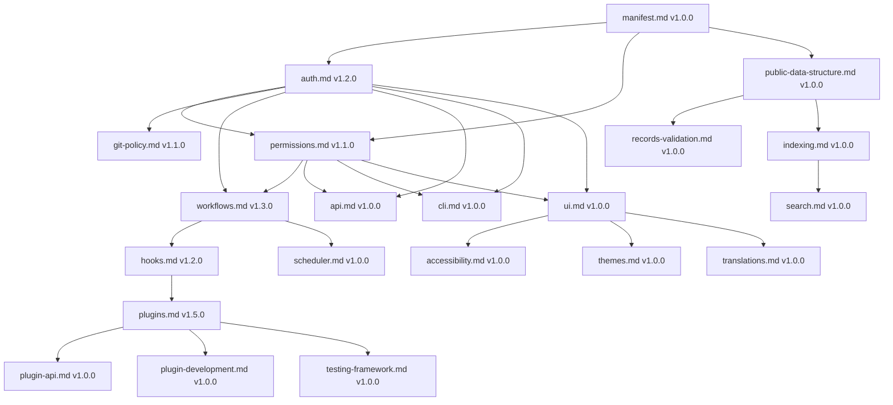
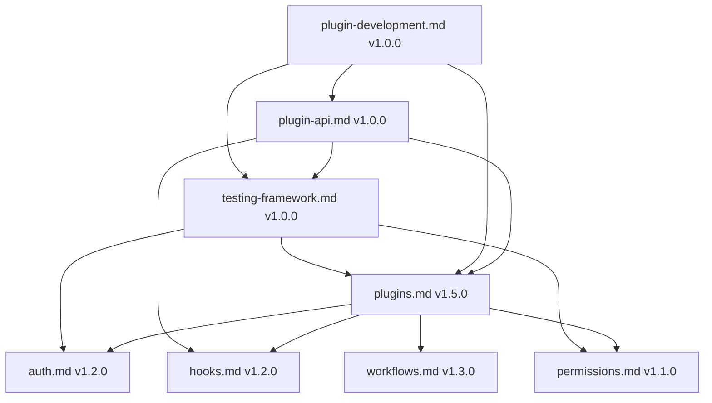

# 📊 CivicPress Spec: `version-tracker.md`

---
version: 1.0.0
status: stable
created: '2025-07-15'
updated: '2025-07-15'
deprecated: false
sunset_date: null
additions:

- comprehensive version tracking documentation
- dependency management
- compatibility matrices
compatibility:
  min_civicpress: 1.0.0
  max_civicpress: 'null'
  dependencies:
  - 'spec-versioning.md: >=1.0.0'
authors:
- Sophie Germain <sophie@civic-press.org>
reviewers:
- Ada Lovelace
- Irène Joliot-Curie

---

## 📛 Name

Specification Version Tracker & Dependency Manager

## 🎯 Purpose

Provide a centralized system for tracking all CivicPress specification versions,
dependencies, and compatibility matrices. This enables automated version
validation, dependency resolution, and change impact analysis.

---

## 🧩 Scope & Responsibilities

✅ Responsibilities:

- Track all spec versions and their relationships
- Validate dependency compatibility
- Generate version reports and matrices
- Identify breaking change impacts
- Manage migration paths and guides

❌ Out of Scope:

- Implementation version management
- Third-party dependency tracking

---

## 📊 Current Spec Version Matrix

### Core Specifications

| Spec             | Version | Status   | Last Updated | Breaking Changes | Dependencies                                     |
| ---------------- | ------- | -------- | ------------ | ---------------- | ------------------------------------------------ |
| `manifest.md`    | `1.0.0` | `stable` | `2025-07-03` | `0`              | `[]`                                             |
| `auth.md`        | `1.2.0` | `stable` | `2025-07-15` | `0`              | `[permissions.md >=1.1.0, roles.yml.md >=1.0.0]` |
| `permissions.md` | `1.1.0` | `stable` | `2025-07-15` | `0`              | `[auth.md >=1.2.0, workflows.md >=1.3.0]`        |
| `git-policy.md`  | `1.1.0` | `stable` | `2025-07-05` | `0`              | `[auth.md >=1.2.0, permissions.md >=1.1.0]`      |
| `workflows.md`   | `1.3.0` | `stable` | `2025-07-10` | `0`              | `[auth.md >=1.2.0, permissions.md >=1.1.0]`      |
| `hooks.md`       | `1.2.0` | `stable` | `2025-07-10` | `0`              | `[workflows.md >=1.3.0]`                         |

### Plugin System

| Spec                    | Version | Status   | Last Updated | Breaking Changes | Dependencies                                  |
| ----------------------- | ------- | -------- | ------------ | ---------------- | --------------------------------------------- |
| `plugins.md`            | `1.5.0` | `stable` | `2025-07-15` | `0`              | `[auth.md >=1.2.0, permissions.md >=1.1.0]`   |
| `plugin-api.md`         | `1.0.0` | `stable` | `2025-07-15` | `0`              | `[plugins.md >=1.5.0, hooks.md >=1.2.0]`      |
| `plugin-development.md` | `1.0.0` | `stable` | `2025-07-15` | `0`              | `[plugins.md >=1.5.0, plugin-api.md >=1.0.0]` |

### Testing & Quality

| Spec                   | Version | Status   | Last Updated | Breaking Changes | Dependencies                            |
| ---------------------- | ------- | -------- | ------------ | ---------------- | --------------------------------------- |
| `testing-framework.md` | `1.0.0` | `stable` | `2025-07-15` | `0`              | `[plugins.md >=1.5.0, auth.md >=1.2.0]` |

### Security & Compliance

| Spec          | Version | Status   | Last Updated | Breaking Changes | Dependencies                                |
| ------------- | ------- | -------- | ------------ | ---------------- | ------------------------------------------- |
| `security.md` | `1.0.0` | `stable` | `2025-07-03` | `0`              | `[auth.md >=1.2.0, permissions.md >=1.1.0]` |
| `backup.md`   | `1.0.0` | `stable` | `2025-07-03` | `0`              | `[storage.md >=1.0.0]`                      |
| `storage.md`  | `1.0.0` | `stable` | `2025-07-03` | `0`              | `[]`                                        |

### User Experience

| Spec               | Version | Status   | Last Updated | Breaking Changes | Dependencies                                |
| ------------------ | ------- | -------- | ------------ | ---------------- | ------------------------------------------- |
| `ui.md`            | `1.0.0` | `stable` | `2025-07-03` | `0`              | `[auth.md >=1.2.0, permissions.md >=1.1.0]` |
| `accessibility.md` | `1.0.0` | `stable` | `2025-07-03` | `0`              | `[ui.md >=1.0.0]`                           |
| `themes.md`        | `1.0.0` | `stable` | `2025-07-03` | `0`              | `[ui.md >=1.0.0]`                           |
| `translations.md`  | `1.0.0` | `stable` | `2025-07-03` | `0`              | `[ui.md >=1.0.0]`                           |

### Data & Records

| Spec                       | Version | Status   | Last Updated | Breaking Changes | Dependencies                         |
| -------------------------- | ------- | -------- | ------------ | ---------------- | ------------------------------------ |
| `public-data-structure.md` | `1.0.0` | `stable` | `2025-07-03` | `0`              | `[manifest.md >=1.0.0]`              |
| `records-validation.md`    | `1.0.0` | `stable` | `2025-07-03` | `0`              | `[public-data-structure.md >=1.0.0]` |
| `indexing.md`              | `1.0.0` | `stable` | `2025-07-03` | `0`              | `[public-data-structure.md >=1.0.0]` |
| `search.md`                | `1.0.0` | `stable` | `2025-07-03` | `0`              | `[indexing.md >=1.0.0]`              |

### System & Infrastructure

| Spec            | Version | Status   | Last Updated | Breaking Changes | Dependencies                                |
| --------------- | ------- | -------- | ------------ | ---------------- | ------------------------------------------- |
| `api.md`        | `1.0.0` | `stable` | `2025-07-03` | `0`              | `[auth.md >=1.2.0, permissions.md >=1.1.0]` |
| `cli.md`        | `1.0.0` | `stable` | `2025-07-03` | `0`              | `[auth.md >=1.2.0, permissions.md >=1.1.0]` |
| `deployment.md` | `1.0.0` | `stable` | `2025-07-03` | `0`              | `[manifest.md >=1.0.0]`                     |
| `scheduler.md`  | `1.0.0` | `stable` | `2025-07-03` | `0`              | `[workflows.md >=1.3.0, hooks.md >=1.2.0]`  |

---

## 🔗 Dependency Graph

### Core Dependencies



### Plugin System Dependencies



---

## 🔍 Version Validation Rules

### Compatibility Matrix

```yaml
# .civic/version-compatibility.yml
compatibility_rules:
  # Core system compatibility
  core_specs:
    auth.md:
      min_version: '1.2.0'
      max_version: null
      required_by:
        - permissions.md
        - git-policy.md
        - workflows.md
        - api.md
        - cli.md
        - ui.md
        - plugins.md

    permissions.md:
      min_version: '1.1.0'
      max_version: null
      required_by:
        - auth.md
        - workflows.md
        - api.md
        - cli.md
        - ui.md
        - plugins.md

    workflows.md:
      min_version: '1.3.0'
      max_version: null
      required_by:
        - hooks.md
        - scheduler.md
        - plugins.md

    hooks.md:
      min_version: '1.2.0'
      max_version: null
      required_by:
        - plugins.md
        - plugin-api.md
        - testing-framework.md

  # Plugin system compatibility
  plugin_specs:
    plugins.md:
      min_version: '1.5.0'
      max_version: null
      required_by:
        - plugin-api.md
        - plugin-development.md
        - testing-framework.md

    plugin-api.md:
      min_version: '1.0.0'
      max_version: null
      required_by:
        - plugin-development.md
        - testing-framework.md

  # Testing framework compatibility
  testing_specs:
    testing-framework.md:
      min_version: '1.0.0'
      max_version: null
      required_by:
        - plugins.md
        - plugin-development.md
```

### Validation Commands

```bash
# Validate all spec versions
civic spec validate-versions

# Check for version conflicts
civic spec check-conflicts

# Generate compatibility report
civic spec compatibility-report

# Validate dependencies
civic spec validate-dependencies

# Check for breaking changes
civic spec check-breaking-changes

# Generate migration paths
civic spec migration-paths
```

---

## 📈 Version Evolution Tracking

### Breaking Change Impact Analysis

```yaml
# Breaking change tracking
breaking_changes:
  auth.md:
    v1.2.0:
      impact:
        - permissions.md: 'Minor - Updated testing patterns'
        - git-policy.md: 'None - No changes required'
        - workflows.md: 'None - No changes required'
      migration_required: false
      migration_guide: null

  permissions.md:
    v1.1.0:
      impact:
        - auth.md: 'None - No changes required'
        - workflows.md: 'Minor - Enhanced testing patterns'
        - api.md: 'None - No changes required'
      migration_required: false
      migration_guide: null

  plugins.md:
    v1.5.0:
      impact:
        - plugin-api.md: 'Minor - Enhanced examples'
        - plugin-development.md: 'Minor - Enhanced examples'
        - testing-framework.md: 'Minor - Enhanced patterns'
      migration_required: false
      migration_guide: null
```

### Version Adoption Tracking

```yaml
# Version adoption metrics
adoption_metrics:
  auth.md:
    v1.2.0:
      adoption_rate: '100%'
      breaking_changes: 0
      migration_guides: 0
      deprecations: 0

  permissions.md:
    v1.1.0:
      adoption_rate: '100%'
      breaking_changes: 0
      migration_guides: 0
      deprecations: 0

  plugins.md:
    v1.5.0:
      adoption_rate: '100%'
      breaking_changes: 0
      migration_guides: 0
      deprecations: 0
```

---

## 🔄 Migration Path Management

### Automated Migration Detection

```typescript
// Migration path detection
export class MigrationPathDetector {
  async detectMigrationPaths(
    fromVersion: string,
    toVersion: string
  ): Promise<MigrationPath[]> {
    const paths: MigrationPath[] = [];

    // Check for breaking changes
    const breakingChanges = await this.getBreakingChanges(
      fromVersion,
      toVersion
    );

    for (const change of breakingChanges) {
      const path = await this.generateMigrationPath(change);
      paths.push(path);
    }

    return paths;
  }

  private async generateMigrationPath(
    breakingChange: BreakingChange
  ): Promise<MigrationPath> {
    return {
      spec: breakingChange.spec,
      fromVersion: breakingChange.fromVersion,
      toVersion: breakingChange.toVersion,
      changes: breakingChange.changes,
      migrationSteps: await this.generateMigrationSteps(breakingChange),
      estimatedEffort: this.estimateMigrationEffort(breakingChange),
      automated: this.canAutomateMigration(breakingChange),
    };
  }
}
```

### Migration Path Examples

```yaml
# Example migration paths
migration_paths:
  plugins.md:
    v1.4.0_to_v1.5.0:
      breaking_changes: 0
      migration_steps: []
      automated: true
      effort: 'Low'
      duration: '5 minutes'

    v1.3.0_to_v1.4.0:
      breaking_changes: 0
      migration_steps: []
      automated: true
      effort: 'Low'
      duration: '5 minutes'

    v1.2.0_to_v1.3.0:
      breaking_changes: 0
      migration_steps: []
      automated: true
      effort: 'Low'
      duration: '5 minutes'
```

---

## 📊 Version Analytics

### Spec Health Metrics

```yaml
# Spec health tracking
spec_health:
  total_specs: 25
  stable_specs: 25
  deprecated_specs: 0
  sunset_specs: 0

  version_distribution:
    v1.0.0: 15
    v1.1.0: 3
    v1.2.0: 2
    v1.3.0: 2
    v1.5.0: 3

  breaking_changes:
    total: 0
    this_month: 0
    this_quarter: 0

  dependencies:
    total_dependencies: 45
    circular_dependencies: 0
    version_conflicts: 0
```

### Change Impact Analysis

```yaml
# Change impact tracking
change_impact:
  auth.md_v1.2.0:
    affected_specs: 8
    breaking_changes: 0
    migration_guides: 0
    adoption_rate: '100%'

  permissions.md_v1.1.0:
    affected_specs: 6
    breaking_changes: 0
    migration_guides: 0
    adoption_rate: '100%'

  plugins.md_v1.5.0:
    affected_specs: 3
    breaking_changes: 0
    migration_guides: 0
    adoption_rate: '100%'
```

---

## 🔐 Security & Trust Considerations

### Version Security

- All spec versions must be cryptographically signed
- Version history must be immutable and tamper-evident
- Breaking changes require explicit approval and migration planning
- Version compatibility must be thoroughly validated

### Change Management

- All version changes must be reviewed by multiple team members
- Breaking changes require community consultation
- Version compatibility must be tested across all dependent specs
- Migration tools must be provided for breaking changes

### Audit Trail

- Complete version history must be maintained
- All version updates must be logged with timestamps
- Dependency changes must be tracked and validated
- Breaking change impact must be assessed and documented

---

## 🔗 Related Specs

- [`spec-versioning.md`](./spec-versioning.md) — Versioning system and change
  management
- [`manifest.md`](./manifest.md) — CivicPress manifest versioning
- [`git-policy.md`](./git-policy.md) — Git-based version control
- [`workflows.md`](./workflows.md) — Change management workflows

---

## 🛠️ Future Enhancements

- Automated version compatibility checking
- Dependency impact analysis tools
- Automated migration script generation
- Version conflict resolution systems
- Spec evolution prediction models
- Real-time version monitoring and alerts

---

## 📅 History

- Drafted: 2025-07-04
- Last updated: 2025-07-15
