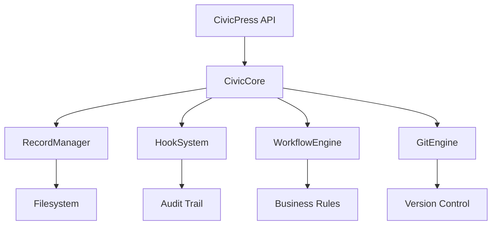
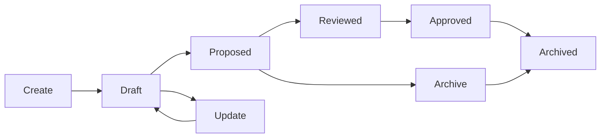

# CivicCore

The core platform for CivicPress, providing record management, hooks, workflows,
and Git integration.

## Overview

CivicCore is the central engine that powers CivicPress's civic record management
system. It provides:

- **Record Management**: Create, update, archive, and retrieve civic records
- **Hook System**: Event-driven architecture for audit trails and workflows
- **Workflow Engine**: Process automation and business rule enforcement
- **Git Integration**: Automatic version control with role-based commits
- **Permission System**: Role-based access control via workflow configuration

## Architecture



## RecordManager

The `RecordManager` is the central component responsible for all civic record
operations. It ensures that every record change:

1. **Validates permissions** via the workflow configuration
2. **Triggers appropriate hooks** for audit trails and notifications
3. **Creates Git commits** with role-based messages
4. **Maintains data integrity** through proper file operations

### Key Features

- **Logical Delete**: Records are never physically deleted, but archived with
  full metadata
- **Audit Trail**: Every operation is logged with user, timestamp, and action
  details
- **Role-Based Access**: Permissions are enforced based on user roles and record
  types
- **Git Integration**: Automatic commits with descriptive, role-aware messages
- **Hook System**: Extensible event system for custom business logic

### Record Lifecycle



### Usage Example

```typescript
import { CivicPress } from '@civicpress/core';

const civicPress = new CivicPress();
await civicPress.getCore().initialize();

const recordManager = civicPress.getCore().getRecordManager(
  hooks, git, workflows, templates
);

// Create a record
const record = await recordManager.createRecord({
  title: "New Bylaw",
  type: "bylaw",
  content: "# New Bylaw\n\nContent here...",
  metadata: { priority: "high" }
}, "admin");

// Update a record
const updatedRecord = await recordManager.updateRecord(
  record.id,
  { status: "proposed", content: "Updated content..." },
  "council"
);

// Archive a record
await recordManager.archiveRecord(record.id, "admin");
```

## Hook System

The `HookSystem` provides an event-driven architecture for extending CivicPress
functionality:

### Available Hooks

- `record:created` - Triggered when a new record is created
- `record:updated` - Triggered when a record is modified
- `record:archived` - Triggered when a record is archived
- `status:changed` - Triggered when a record status changes
- `validation:failed` - Triggered when record validation fails

### Hook Example

```typescript
const hooks = civicPress.getHookSystem();

hooks.registerHook('record:created', (data, context) => {
  console.log(`Record created: ${data.record.title}`);
  // Send notifications, update indexes, etc.
});
```

## Workflow Engine

The `WorkflowEngine` manages business process automation:

### Built-in Workflows

- **Approval Workflow**: Manages record approval processes
- **Publication Workflow**: Handles record publication and notification
- **Archival Workflow**: Manages record archival and cleanup

### Custom Workflows

```typescript
const workflows = civicPress.getWorkflowEngine();

workflows.registerWorkflow('custom-approval', async (data, workflowId) => {
  // Custom business logic
  await notifyStakeholders(data.record);
  await updateExternalSystems(data.record);
});
```

## Git Integration

The `GitEngine` provides automatic version control with role-aware commits:

### Features

- **Automatic Commits**: Every record change creates a Git commit
- **Role-Based Messages**: Commit messages include the user's role
- **Audit Trail**: Full history of who changed what and when
- **Branch Management**: Support for different record states and versions

### Commit Message Format

```
feat(role): Action record_type: record_title
```

Examples:

- `feat(admin): Create bylaw: New Traffic Regulations`
- `feat(council): Update policy: Updated Budget Guidelines`
- `feat(clerk): Archive resolution: Old Meeting Procedures`

## Permission System

Permissions are managed through the workflow configuration
(`data/.civic/workflows.yml`):

### Role Permissions

```yaml
roles:
  admin:
    can_create: [bylaw, policy, resolution]
    can_edit: [bylaw, policy, resolution]
    can_delete: [bylaw, policy, resolution]
    can_transition:
      draft: [proposed]
      any: [archived]

  clerk:
    can_create: [bylaw, policy, resolution]
    can_edit: [bylaw, policy, resolution]
    can_transition:
      draft: [proposed]
      any: [archived]

  council:
    can_create: [bylaw, policy, resolution]
    can_edit: [bylaw, policy, resolution]
    can_delete: [bylaw, policy, resolution]
    can_transition:
      reviewed: [approved]
      any: [archived]

  public:
    can_view: [bylaw, policy, resolution]
```

## Data Structure

### Record Files

Records are stored as Markdown files with YAML frontmatter:

```markdown
---
title: Record Title
type: bylaw
status: draft
author: admin
version: 1.0.0
created: 2025-07-09T15:46:32.263Z
updated: 2025-07-09T15:48:21.082Z
priority: high
department: planning
---

# Record Title

Record content goes here...
```

### Directory Structure

```
data/
├── records/
│   ├── bylaw/
│   ├── policy/
│   └── resolution/
├── archive/
│   ├── bylaw/
│   ├── policy/
│   └── resolution/
└── .civic/
    ├── config.yml
    ├── workflows.yml
    └── hooks.yml
```

## Integration Points

### API Integration

The CivicCore integrates with the REST API through the `RecordsService`:

```typescript
// API endpoint calls CivicCore
const record = await recordsService.createRecord(data, userRole);
// This triggers: permission check → file creation → hooks → Git commit
```

### CLI Integration

The CLI commands use the same CivicCore components:

```typescript
// CLI command uses CivicCore
await civicPress.getCore().getRecordManager().createRecord(request, role);
```

## Error Handling

CivicCore provides comprehensive error handling:

- **Permission Errors**: Clear messages when users lack required permissions
- **Validation Errors**: Detailed feedback for invalid record data
- **File System Errors**: Graceful handling of disk space, permissions, etc.
- **Git Errors**: Proper error messages for repository issues

## Development

### Building

```bash
cd core
pnpm install
pnpm run build
```

### Testing

```bash
pnpm run test
```

### Adding New Features

1. **New Record Types**: Add to `RecordManager.createRecord()` validation
2. **New Hooks**: Register in `HookSystem` and document
3. **New Workflows**: Add to `WorkflowEngine` and configure
4. **New Permissions**: Update workflow configuration

## See Also

- [API Documentation](../modules/api/README.md)
- [CLI Documentation](../cli/README.md)
- [Workflow Configuration](../data/.civic/workflows.yml)
- [Hook Configuration](../data/.civic/hooks.yml)
