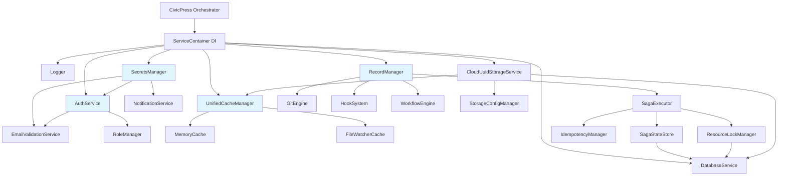
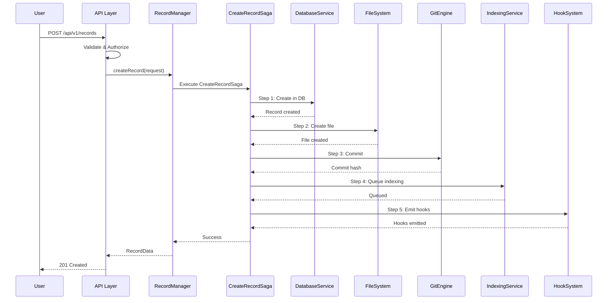
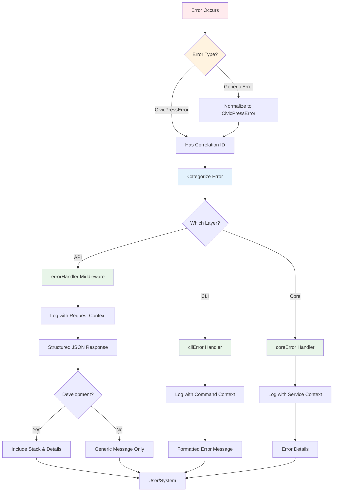
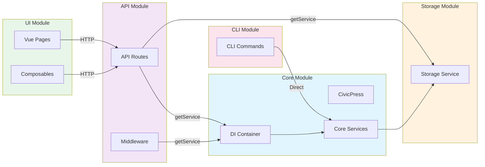
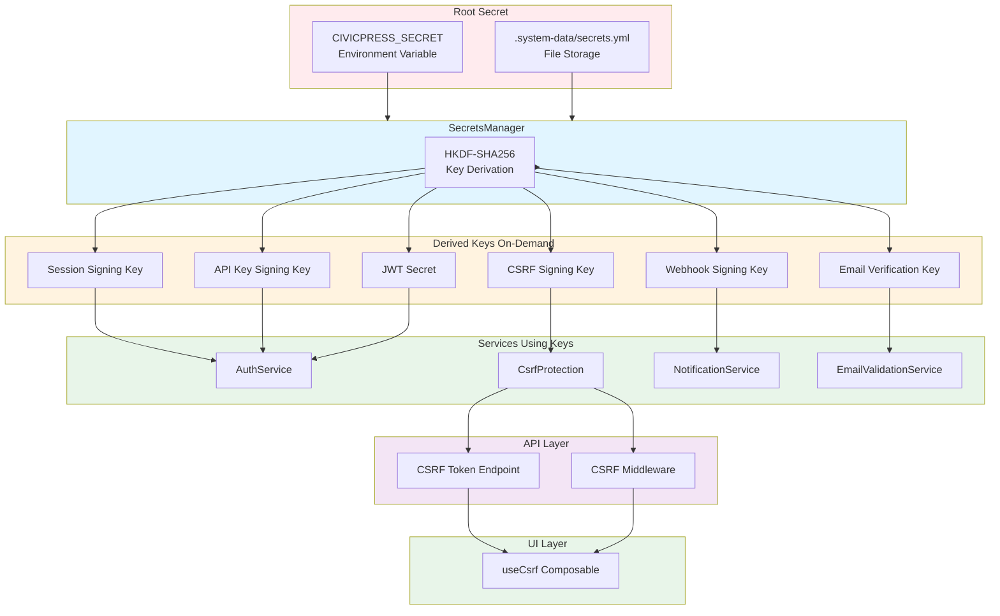
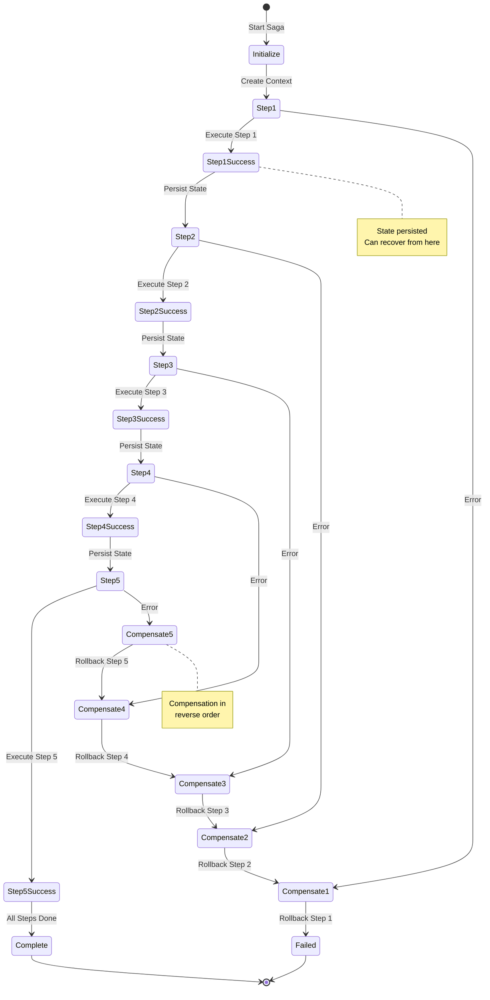
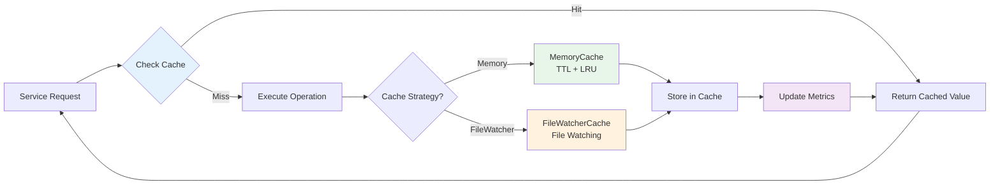

# CivicPress Architecture Diagrams

**Last Updated:** 2025-01-30  
**Version:** v0.2.0  
**Status:** Active  
**Format:** Mermaid diagrams

---

This document contains visual architecture diagrams for CivicPress. These
diagrams complement the detailed architecture documentation and provide visual
representations of system components, data flows, and interactions.

**Note**: These diagrams use Mermaid syntax and will render in Markdown viewers
that support Mermaid (GitHub, GitLab, many documentation sites, and VS Code with
Mermaid extensions).

---

## 1. Service Dependency Diagram

This diagram shows the dependency injection container structure and how services
depend on each other.

**Key Points:**

- **SecretsManager** is initialized early and used by Auth, Notification, and
  EmailValidation services
- **RecordManager** orchestrates multiple services (Saga, Git, Hooks, Workflow)
- **SagaExecutor** depends on state management and locking services
- **Storage** services are registered in DI container but initialized lazily

---

## 2. Record Creation Data Flow

This sequence diagram shows the complete flow of creating a record using the
Saga pattern.

**Key Points:**

- All steps are compensatable - if any step fails, previous steps are rolled
  back
- State is persisted after each step for recovery
- Saga ensures atomicity across database, filesystem, and Git operations

---

## 3. Error Handling Flow

This flowchart shows how errors are processed across different layers of the
application.

**Key Points:**

- All errors are normalized to CivicPressError with correlation IDs
- Layer-specific handlers provide appropriate formatting
- Development mode includes detailed error information
- Production mode sanitizes error messages for security

---

## 4. Module Interaction Diagram

This diagram shows how different modules interact with the core platform.

**Key Points:**

- **Core** provides foundation services via DI container
- **API** and **CLI** access services directly from DI container
- **UI** communicates with **API** via HTTP
- **Storage** is registered in DI container but can be accessed independently

---

## 5. Security System Architecture

This diagram shows the security system architecture, including secrets
management and CSRF protection.

**Key Points:**

- **Single Root Secret**: All keys derived from one secret using HKDF-SHA256
- **Scoped Keys**: Each service gets its own cryptographically independent key
- **Zero Key Storage**: Keys derived on-demand, never stored
- **CSRF Protection**: Token-based protection for browser requests
- **Production Ready**: Environment variable support for production

---

## 6. Saga Pattern Execution Flow

This diagram shows how the Saga pattern ensures reliable multi-step operations.

**Key Points:**

- **State Persistence**: Each step's state is saved for recovery
- **Compensation**: Failed steps trigger reverse-order compensation
- **Idempotency**: Operations can be safely retried
- **Recovery**: Failed sagas can be recovered and resumed

---

## 7. Caching Strategy Flow

This diagram shows how the unified caching layer works across different
services.

**Key Points:**

- **Unified Interface**: All services use same caching interface
- **Strategy Pattern**: Different strategies for different use cases
- **Metrics**: Cache performance tracked and monitored
- **Automatic Invalidation**: FileWatcherCache invalidates on file changes

---

## Related Documentation

- [Architecture Overview](architecture.md) - Main architecture documentation
- [Architecture Comprehensive Analysis](architecture-comprehensive-analysis.md) -
  Detailed analysis
- [Module Integration Guide](module-integration-guide.md) - Module integration
  patterns
- [Saga Pattern Usage Guide](saga-pattern-usage-guide.md) - Saga pattern details
- [Error Handling Guide](error-handling.md) - Error handling patterns
- [Secrets Management Guide](secrets-management.md) - Security system details

---

**Document Status:** Active  
**Last Updated:** 2025-01-30  
**Maintained By:** Architecture Team
