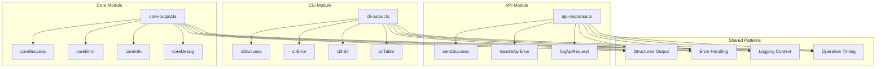

# Centralized Output Patterns

> **⚠ Important**: Never use `console.log()`, `console.error()`, or direct
> console output in CivicPress code. Always use the centralized output functions
> described in this guide.

This document describes the centralized output and logging patterns implemented
across the CivicPress ecosystem. These patterns ensure consistency,
maintainability, and proper handling of output modes (JSON, silent, verbose)
across API, CLI, and Core modules.

## Why Use Centralized Output?

**❌ Don't do this:**

```typescript
console.log('✅ Success!');
console.error('❌ Error:', error);
if (options.json) {
  console.log(JSON.stringify(data));
}
```

**✅ Do this instead:**

```typescript
cliSuccess(data, 'Success!', { operation: 'my-command' });
cliError('Error occurred', 'ERROR_CODE', { error }, 'my-command');
// JSON mode is handled automatically
```

### Benefits

- **Automatic JSON mode**: Output automatically switches to JSON when `--json`
  flag is used
- **Silent mode support**: Respects `--silent` flag automatically
- **Consistent formatting**: Uniform output format across all commands
- **Rich context**: Operation timing, metadata, and debugging information
- **Type safety**: TypeScript interfaces ensure correct usage
- **Better testing**: Structured output is easier to test

## Overview

The CivicPress project implements three centralized output systems:

1. **API Response System** (`modules/api/src/utils/api-logger.ts`) - For REST
   API endpoints
2. **CLI Output System** (`cli/src/utils/cli-output.ts`) - For command-line
   interface
3. **Core Output System** (`core/src/utils/core-output.ts`) - For core library
   operations

Each system provides structured, consistent output handling with support for:

- Human-readable and JSON output modes
- Structured error handling
- Operation timing and context
- Logging integration
- Type safety

## Architecture



## CLI Output System

**Location**: `cli/src/utils/cli-output.ts`

### Quick Start

```typescript
import {
  cliSuccess,
  cliError,
  cliInfo,
  cliWarn,
  cliDebug,
  cliTable,
  cliStartOperation,
} from '../utils/cli-output.js';

// Initialize with global options (do this at the start of your command)
import { initializeCliOutput, getGlobalOptionsFromArgs } from '../utils/global-options.js';
const globalOptions = getGlobalOptionsFromArgs();
initializeCliOutput(globalOptions);
```

### Features

- **Structured Output**: Consistent success/error response formats
- **JSON Mode**: Machine-readable output with `--json` flag (automatic)
- **Silent Mode**: Suppress output with `--silent` flag (automatic)
- **Verbose Mode**: Enhanced debugging with `--verbose` flag
- **Table Output**: Formatted table display for structured data
- **Operation Timing**: Automatic timing of CLI operations
- **Context Logging**: Rich logging context for debugging

### Usage Examples

```typescript
import {
  cliSuccess,
  cliError,
  cliInfo,
  cliWarn,
  cliDebug,
  cliTable,
  cliStartOperation,
} from '../utils/cli-output.js';

// Success output
cliSuccess(
  { records: [], total: 0 },
  'No records found',
  { operation: 'list records', totalRecords: 0 }
);

// Error handling
cliError(
  'Failed to load records',
  'LOAD_FAILED',
  { error: 'File not found' },
  'list records'
);

// Info and progress
cliInfo('Loading records...', 'list records');
cliProgress('Processing files...', 'list records');

// Table output
cliTable(
  [
    { name: 'Record 1', status: 'active' },
    { name: 'Record 2', status: 'draft' }
  ],
  ['name', 'status'],
  'list records'
);

// Operation timing
const endOperation = cliStartOperation('list records');
// ... perform operation
endOperation();
```

### Output Formats

#### Human-Readable Mode

```
✅ Successfully listed 5 records
ℹ  Loading records...
⚠  Warning: Some files could not be processed
🔍 Debug: Processing file example.md
🔄 Starting: list records
```

#### JSON Mode

```json
{
  "success": true,
  "data": {
    "records": [...],
    "summary": {...}
  },
  "message": "Successfully listed 5 records",
  "meta": {
    "operation": "list records",
    "totalRecords": 5,
    "duration": 1250
  }
}
```

## Core Output System

**Location**: `core/src/utils/core-output.ts`

### Quick Start

```typescript
import {
  coreSuccess,
  coreError,
  coreInfo,
  coreWarn,
  coreDebug,
  coreStartOperation,
} from '../utils/core-output.js';
```

### Features

- **Logger Integration**: Built on the existing Logger class
- **Context Awareness**: Rich context for debugging and monitoring
- **Structured Logging**: Consistent log format across all operations
- **Operation Tracking**: Automatic operation timing and context
- **Error Context**: Detailed error information with context

### Usage Examples

```typescript
import {
  coreSuccess,
  coreError,
  coreInfo,
  coreWarn,
  coreDebug,
  coreStartOperation,
} from '../utils/core-output.js';

// Success with context
coreSuccess(
  { hooks: ['record:created', 'record:updated'] },
  'Hook system initialized successfully',
  {
    operation: 'hook system initialization',
    registeredHooks: ['record:created', 'record:updated']
  }
);

// Error with context
coreError(
  'Failed to initialize hook system',
  'HOOK_INIT_FAILED',
  { error: 'Configuration file not found' },
  { operation: 'hook system initialization' }
);

// Debug with rich context
coreDebug(
  'Processing record type: bylaws',
  { recordType: 'bylaws', fileCount: 5 },
  'record processing'
);

// Operation timing
const endOperation = coreStartOperation('hook system initialization');
// ... perform operation
endOperation();
```

### Integration with Logger

The Core Output System integrates seamlessly with the existing Logger:

```typescript
// Direct logger access
const logger = coreOutput.getLogger();
logger.info('Custom log message');

// Set log level
coreOutput.setLevel(LogLevel.DEBUG);

// Check modes
if (coreOutput.isSilent()) {
  // Handle silent mode
}
```

## API Response System

**Location**: `modules/api/src/utils/api-response.ts`

### Quick Start

```typescript
import {
  sendSuccess,
  handleApiError,
  handleValidationError,
  logApiRequest,
} from '../utils/api-response.js';
```

### Success Responses

```typescript
// Simple success
sendSuccess(res, data);

// With message
sendSuccess(res, data, 'Records retrieved successfully');

// With metadata
sendSuccess(res, data, 'Operation completed', {
  totalRecords: 5,
  processingTime: 1250
});
```

### Error Handling

```typescript
// API errors
handleApiError(res, error, 'Failed to process request');

// Validation errors
handleValidationError(res, validationErrors, 'Invalid input data');

// Custom error codes
handleApiError(res, error, 'Database connection failed', 503);
```

### Request Logging

```typescript
// Log API request
logApiRequest(req, 'GET /api/records', { userId: req.user?.id });
```

## Common Patterns & Quick Reference

### Command Structure Pattern

```typescript
export const myCommand = (cli: CAC) => {
  cli
    .command('my-command', 'Description')
    .option('--option <value>', 'Option description')
    .action(async (args: string, options: any) => {
      // 1. Initialize output system
      const globalOptions = getGlobalOptionsFromArgs();
      initializeCliOutput(globalOptions);

      // 2. Start operation timing
      const endOperation = cliStartOperation('my-command');

      try {
        // 3. Perform operation
        const result = await doSomething();

        // 4. Report success
        cliSuccess(result, 'Operation completed', {
          operation: 'my-command',
          totalItems: result.length
        });
      } catch (error) {
        // 5. Handle errors
        cliError('Operation failed', 'OPERATION_FAILED', { error }, 'my-command');
        process.exit(1);
      } finally {
        // 6. End operation timing
        endOperation();
      }
    });
};
```

### Error Handling Pattern

```typescript
try {
  // ... operation
  cliSuccess(data, 'Success');
} catch (error) {
  cliError(
    'Operation failed',
    'OPERATION_FAILED',
    {
      error: error instanceof Error ? error.message : String(error),
      context: 'additional context'
    },
    'operation-name'
  );
  process.exit(1);
}
```

### Progress Reporting Pattern

```typescript
cliInfo('Starting operation...', 'operation-name');

for (let i = 0; i < items.length; i++) {
  cliProgress(`Processing item ${i + 1} of ${items.length}`, 'operation-name');
  // ... process item
}

cliSuccess(result, 'Operation completed');
```

### Global Options Reference

| Flag         | Description           | Output                           |
| ------------ | --------------------- | -------------------------------- |
| `--json`     | Machine-readable JSON | Structured JSON with metadata    |
| `--silent`   | Suppress all output   | No output (logs still generated) |
| `--quiet`    | Errors only           | Error messages only              |
| `--verbose`  | Enhanced debugging    | Debug messages + normal output   |
| `--no-color` | Disable colors        | Plain text output                |

**Example:**

```bash
civic list --json          # JSON output
civic list --silent        # No output
civic list --verbose       # Debug output
civic list --quiet         # Errors only
```

## Migration Guide

### From Direct Console Output

**Before:**

```typescript
console.log('✅ Success!');
console.error('❌ Error:', error);
console.log(JSON.stringify(data, null, 2));
```

**After:**

```typescript
cliSuccess(data, 'Success!', { operation: 'my-command' });
cliError('Error occurred', 'ERROR_CODE', { error }, 'my-command');
// JSON output is handled automatically
```

### From Manual JSON Handling

**Before:**

```typescript
if (options.json) {
  console.log(JSON.stringify({ success: true, data }));
} else {
  console.log('✅ Success!');
}
```

**After:**

```typescript
cliSuccess(data, 'Success!', { operation: 'my-command' });
// JSON mode is handled automatically based on --json flag
```

### From Basic Logging

**Before:**

```typescript
logger.info('Processing records...');
logger.error('Failed to process:', error);
```

**After:**

```typescript
coreInfo('Processing records...', { operation: 'record processing' });
coreError('Failed to process', 'PROCESS_FAILED', { error }, { operation: 'record processing' });
```

## Best Practices

### 1. Always Include Operation Context

```typescript
// Good
cliSuccess(data, 'Records loaded', { operation: 'list records' });

// Better
cliSuccess(data, 'Records loaded', {
  operation: 'list records',
  totalRecords: data.length,
  recordTypes: Object.keys(data)
});
```

### 2. Use Descriptive Error Codes

```typescript
// Good
cliError('Failed to load file', 'FILE_LOAD_FAILED', { path: filePath });

// Avoid
cliError('Failed to load file', 'ERROR', { path: filePath });
```

### 3. Provide Rich Context for Debugging

```typescript
coreDebug(
  'Processing record file',
  {
    filePath,
    fileSize: stats.size,
    lastModified: stats.mtime
  },
  'record processing'
);
```

### 4. Use Operation Timing for Performance Monitoring

```typescript
const endOperation = cliStartOperation('import records');
try {
  // ... perform operation
  cliSuccess(result, 'Import completed');
} catch (error) {
  cliError('Import failed', 'IMPORT_FAILED', { error });
} finally {
  endOperation();
}
```

### 5. Handle Silent Mode Appropriately

```typescript
// The output systems handle silent mode automatically
// Just use the normal functions - they'll respect --silent
cliInfo('Processing...', 'my-operation');
cliSuccess(data, 'Done!');
```

## Configuration

### CLI Global Options

The CLI output system respects these global flags:

- `--json`: Output structured JSON
- `--silent`: Suppress all output
- `--quiet`: Suppress info messages
- `--verbose`: Enable debug output
- `--no-color`: Disable color output

### Core Output Options

The Core output system can be configured with:

```typescript
coreOutput.setOptions({
  json: true,
  silent: false,
  verbose: true,
  operation: 'current-operation'
});
```

## Testing

### CLI Output Testing

```typescript
// Test JSON output
const result = await runCommand(['list', '--json']);
expect(JSON.parse(result.stdout)).toMatchObject({
  success: true,
  data: expect.any(Object)
});

// Test silent mode
const result = await runCommand(['list', '--silent']);
expect(result.stdout).toBe('');
```

### Core Output Testing

```typescript
// Test core output functions
coreSuccess(data, 'Test success');
// Verify logger was called with correct parameters

coreError('Test error', 'TEST_ERROR');
// Verify error was logged with context
```

## Future Enhancements

### Planned Features

1. **Metrics Collection**: Automatic collection of operation metrics
2. **Performance Profiling**: Detailed timing breakdowns
3. **Structured Logging**: Integration with external logging systems
4. **Audit Trail**: Comprehensive operation audit trails
5. **Custom Formatters**: Pluggable output formatters

### Integration Opportunities

1. **External Logging**: Integration with ELK stack, DataDog, etc.
2. **Monitoring**: Prometheus metrics collection
3. **Tracing**: Distributed tracing with OpenTelemetry
4. **Analytics**: Usage analytics and performance insights

## Migration Checklist

When updating existing code to use centralized output:

- [ ] Replace all `console.log()` with appropriate output function
      (`cliSuccess`, `cliInfo`, etc.)
- [ ] Replace all `console.error()` with `cliError()` or `coreError()`
- [ ] Remove manual JSON handling (`if (options.json) { ... }`)
- [ ] Add operation context to all output calls
- [ ] Use descriptive error codes (not generic "ERROR")
- [ ] Add operation timing where appropriate
- [ ] Test both human-readable and JSON output modes
- [ ] Test silent mode behavior
- [ ] Update tests to verify output format

## Common Mistakes to Avoid

### Don't

```typescript
// Direct console usage
console.log('Success!');
console.error('Error:', error);

// Manual JSON handling
if (options.json) {
  console.log(JSON.stringify(data));
} else {
  console.log('Success!');
}

// Missing context
cliSuccess(data, 'Done');
```

### Do

```typescript
// Use centralized functions
cliSuccess(data, 'Success!', { operation: 'my-command' });
cliError('Error occurred', 'ERROR_CODE', { error }, 'my-command');

// Let system handle JSON mode automatically
cliSuccess(data, 'Success!', { operation: 'my-command' });

// Include rich context
cliSuccess(data, 'Done', {
  operation: 'my-command',
  totalItems: data.length,
  processingTime: duration
});
```

## Conclusion

The centralized output patterns provide:

- **Consistency**: Uniform output across all modules
- **Maintainability**: Single source of truth for output logic
- **Type Safety**: TypeScript interfaces for all output formats
- **Observability**: Rich context for debugging and monitoring
- **Flexibility**: Support for multiple output modes and formats

**Remember**: Always use the centralized output functions. Never use
`console.log()` or `console.error()` directly in CivicPress code.

This system ensures that CivicPress provides a professional, consistent user
experience across all interfaces while maintaining the flexibility needed for
different use cases and environments.
