# 🧱 CivicPress Development Pattern: CLI → Core → API

CivicPress follows a **CLI-first architecture** to ensure that each new feature
is:

- Easy to test locally
- Independent of frontend/API concerns
- Backed by reusable, modular core logic

---

## 📐 Development Flow

### 1. 🛠️ CLI Layer

Every new feature begins as a `civic` CLI command.

- Example: `civic approve`, `civic new bylaw`, `civic serve`
- This enforces clarity, minimalism, and usability by humans
- Commands are fast, offline-friendly, and scriptable

### 2. ⚙️ Core Logic Layer

The CLI wraps logic in `core/`:

- Pure functions and civic business logic
- All validations, transitions, hooks, and workflows
- No I/O or UI dependencies
- Testable via Vitest and callable by API/CLI

### 3. 🌐 API Layer

The REST API wraps the same core logic:

- Exposes civic actions via `/api/` endpoints
- Thin layer: no duplicate logic
- May shell out to the CLI or call core directly

---

## ✅ Benefits

- **Consistency**: Everything runs the same logic across CLI, API, UI
- **Traceability**: CLI use can be logged or version-controlled
- **Transparency**: Encourages civic trust in system behavior
- **Scalability**: Clean separation allows easier scaling and testing

---

## 🔁 Visual Overview

```mermaid
graph TD
  CLI["🛠️ CLI Command (e.g. civic approve)"]
  Core["⚙️ Core Logic (e.g. approveRecord())"]
  API["🌐 API Route (/api/approve)"]

  CLI --> Core
  API --> Core
```



---

## 🚀 Development Commands

### API Development

```bash
# Start API with file watching (recommended)
pnpm run dev:api:watch

# Start API without watch
pnpm run dev:api

# Start both API and UI with API watching
pnpm run dev:all:watch
```

### UI Development

```bash
# Start UI development server
pnpm run dev:ui
```

### Combined Development

```bash
# Start both API and UI (no watch)
pnpm run dev:all

# Start all services in parallel
pnpm run dev:parallel
```

---

## 🤖 Agent Note

All AI or agent-based development for CivicPress **must follow this flow**:

- Begin with CLI logic
- Extract reusable logic to `core/`
- Only expose via API or UI once stable
