# 🧱 CivicPress Development Pattern: CLI → Core → API

CivicPress follows a **CLI-first architecture** to ensure that each new feature
is:

- Easy to test locally
- Independent of frontend/API concerns
- Backed by reusable, modular core logic

---

## 📐 Development Flow

### 1. 🛠️ CLI Layer

Every new feature begins as a `civic` CLI command.

- Example: `civic approve`, `civic new bylaw`, `civic serve`
- This enforces clarity, minimalism, and usability by humans
- Commands are fast, offline-friendly, and scriptable

### 2. ⚙️ Core Logic Layer

The CLI wraps logic in `core/`:

- Pure functions and civic business logic
- All validations, transitions, hooks, and workflows
- No I/O or UI dependencies
- Testable via Vitest and callable by API/CLI

### 3. 🌐 API Layer

The REST API wraps the same core logic:

- Exposes civic actions via `/api/` endpoints
- Thin layer: no duplicate logic
- May shell out to the CLI or call core directly

---

## ✅ Benefits

- **Consistency**: Everything runs the same logic across CLI, API, UI
- **Traceability**: CLI use can be logged or version-controlled
- **Transparency**: Encourages civic trust in system behavior
- **Scalability**: Clean separation allows easier scaling and testing

---

## 🔁 Visual Overview

```mermaid
graph TD
  CLI["🛠️ CLI Command (e.g. civic approve)"]
  Core["⚙️ Core Logic (e.g. approveRecord())"]
  API["🌐 API Route (/api/approve)"]

  CLI --> Core
  API --> Core
```



---

## 🚀 Development Commands

### API Development

```bash
# Start API (watch mode by default)
pnpm run dev:api
```

### UI Development

```bash
# Start UI development server
pnpm run dev:ui
```

### Combined Development

```bash
# Start both API and UI in watch mode (recommended)
pnpm run dev

# All services in parallel
pnpm run dev:parallel
```

**Note**: Both `pnpm run dev` and `pnpm run dev:api` run in watch mode by
default, automatically restarting when files change.

---

## 🤖 Agent Note

All AI or agent-based development for CivicPress **must follow this flow**:

- Begin with CLI logic
- Extract reusable logic to `core/`
- Only expose via API or UI once stable

---

## 🛡️ Error Handling Pattern

### Centralized Error Management

CivicPress uses a centralized error handling approach:

- **`useErrorHandler` Composable**: Provides specialized error handlers for
  different error types
- **API Interceptor**: Automatic error handling in `civicApi` plugin with user
  feedback
- **Consistent UX**: Toast notifications for all errors with appropriate styling
  and timeouts

### Error Handler Types

- **API Errors**: General API failures with user-friendly messages
- **Network Errors**: Connection issues with clear guidance
- **Validation Errors**: Form validation with field-specific details
- **Auth Errors**: Authentication issues with security focus

### Implementation Pattern

```typescript
// In stores and components
const { handleError } = useErrorHandler()

try {
  // API call
} catch (error) {
  const errorMessage = handleError(error, {
    title: 'Operation Failed',
    showToast: true
  })
  // Handle error state
}
```

### Benefits

- **Consistent UX**: All errors handled uniformly across the application
- **Automatic Feedback**: Toast notifications for immediate user feedback
- **Better Debugging**: Centralized logging and error categorization
- **Maintainable Code**: Single place to update error handling logic
