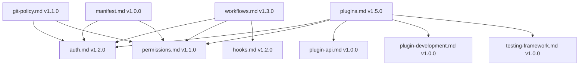
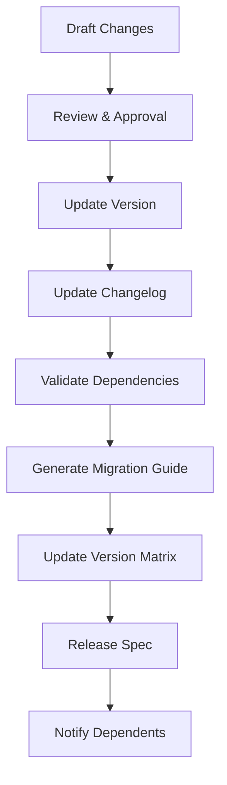

# CivicPress Spec: `spec-versioning.md`

---

version: 1.0.0 status: stable created: '2025-07-04' updated: '2025-07-15'
deprecated: false sunset_date: null authors:

- 'Sophie Germain <sophie@civicpress.io>' reviewers:
- 'Ada Lovelace'
- 'Irène Joliot-Curie'

---

## Name

Specification Versioning & Change Management

## Purpose

Establish a standardized versioning system for CivicPress specifications to
track changes, maintain backward compatibility, and ensure clear communication
of updates across the development team and community.

---

## Scope & Responsibilities

Responsibilities:

- Define versioning scheme and change classification
- Establish change tracking and documentation standards
- Provide migration guidance for breaking changes
- Ensure backward compatibility policies
- Create deprecation and sunsetting procedures

Out of Scope:

- Implementation versioning (handled by semantic versioning)
- Third-party dependency versioning

---

## Inputs & Outputs

| Input | Description |
| ---------------------- | --------------------------------------- |
| Spec files | Markdown specification files to version |
| Version metadata | Version numbers, status, and dates |
| Change requests | Proposed changes and modifications |
| Dependency updates | Changes to spec dependencies |
| Migration requirements | Breaking change migration needs |

| Output | Description |
| --------------------- | --------------------------------------------- |
| Versioned specs | Updated specification files with new versions |
| Changelog entries | Documented changes and classifications |
| Migration guides | Step-by-step migration instructions |
| Version matrices | Compatibility and dependency matrices |
| Release notifications | Notifications of spec updates |

---

## File/Folder Location

```
.civic/
├── spec-versioning.yml # Versioning configuration
├── changelog/ # Changelog files
│ ├── auth.md.changelog
│ ├── permissions.md.changelog
│ └── plugins.md.changelog
├── migration-guides/ # Migration documentation
│ ├── v1.4.0-to-v2.0.0.md
│ └── v1.5.0-to-v2.0.0.md
└── version-matrices/ # Version compatibility data
 ├── compatibility.yml
 └── dependencies.yml

core/
├── spec-versioning.ts # Versioning logic
├── changelog-generator.ts # Changelog generation
├── migration-validator.ts # Migration validation
└── version-resolver.ts # Version dependency resolution

modules/
├── spec-versioning/
│ ├── components/
│ │ ├── VersionManager.tsx # Version management UI
│ │ ├── ChangelogViewer.tsx # Changelog display
│ │ └── MigrationGuide.tsx # Migration guide display
│ ├── hooks/
│ │ └── useSpecVersioning.ts # Versioning data hook
│ └── utils/
│ ├── version-parser.ts # Version parsing utilities
│ └── migration-checker.ts # Migration validation
└── ui/
 └── components/
 └── SpecVersioningProvider.tsx # Versioning context provider

tests/
├── spec-versioning/
│ ├── version-validation.test.ts
│ ├── changelog-generation.test.ts
│ └── migration-validation.test.ts
└── integration/
 └── spec-versioning-integration.test.ts
```

---

## Testing & Validation

### Version Validation Testing

```typescript
// Test version validation and parsing
export class VersionValidationTests {
 async testVersionValidation(): Promise<TestResult[]> {
 return [
 await this.testSemanticVersioning(),
 await this.testVersionComparison(),
 await this.testBreakingChangeDetection(),
 await this.testDependencyValidation(),
 ];
 }

 private async testSemanticVersioning(): Promise<TestResult> {
 const versionTests = [
 { version: '1.0.0', expected: true },
 { version: '1.5.0-alpha.1', expected: true },
 { version: '2.0.0+2025.07.04', expected: true },
 { version: 'invalid-version', expected: false },
 { version: '1.0', expected: false },
 ];

 const results = await Promise.all(
 versionTests.map(test => this.validateSemanticVersion(test.version))
 );

 const passed = results.every((r, i) => r.valid === versionTests[i].expected);

 return {
 test: 'Semantic Versioning',
 passed,
 details: { versionTests, results },
 };
 }

 private async testBreakingChangeDetection(): Promise<TestResult> {
 const changeTests = [
 { from: '1.0.0', to: '2.0.0', breaking: true },
 { from: '1.0.0', to: '1.1.0', breaking: false },
 { from: '1.0.0', to: '1.0.1', breaking: false },
 ];

 const results = await Promise.all(
 changeTests.map(test => this.detectBreakingChanges(test.from, test.to))
 );

 const passed = results.every((r, i) => r.hasBreakingChanges === changeTests[i].breaking);

 return {
 test: 'Breaking Change Detection',
 passed,
 details: { changeTests, results },
 };
 }
}
```

### Migration Path Testing

```typescript
// Test migration path generation and validation
export class MigrationPathTests {
 async testMigrationPaths(): Promise<TestResult[]> {
 return [
 await this.testMigrationPathGeneration(),
 await this.testMigrationPathValidation(),
 await this.testAutomatedMigration(),
 await this.testMigrationRollback(),
 ];
 }

 private async testMigrationPathGeneration(): Promise<TestResult> {
 const migrationTests = [
 { from: '1.0.0', to: '2.0.0', expectedSteps: 3 },
 { from: '1.5.0', to: '1.6.0', expectedSteps: 1 },
 { from: '1.0.0', to: '1.0.1', expectedSteps: 0 },
 ];

 const results = await Promise.all(
 migrationTests.map(test => this.generateMigrationPath(test.from, test.to))
 );

 const passed = results.every((r, i) =>
 r.steps.length === migrationTests[i].expectedSteps
 );

 return {
 test: 'Migration Path Generation',
 passed,
 details: { migrationTests, results },
 };
 }

 private async testAutomatedMigration(): Promise<TestResult> {
 const migration = await this.performAutomatedMigration(
 'test-spec.md',
 '1.0.0',
 '2.0.0'
 );

 return {
 test: 'Automated Migration',
 passed: migration.success && migration.changesApplied > 0,
 details: { migration },
 };
 }
}
```

### Dependency Resolution Testing

```typescript
// Test dependency resolution and conflict detection
export class DependencyResolutionTests {
 async testDependencyResolution(): Promise<TestResult[]> {
 return [
 await this.testDependencyValidation(),
 await this.testConflictDetection(),
 await this.testCircularDependencyDetection(),
 await this.testDependencyGraphValidation(),
 ];
 }

 private async testDependencyValidation(): Promise<TestResult> {
 const dependencyTests = [
 { spec: 'auth.md', version: '1.2.0', dependencies: ['permissions.md >=1.1.0'], expected: true },
 { spec: 'plugins.md', version: '1.5.0', dependencies: ['auth.md >=1.2.0'], expected: true },
 { spec: 'invalid.md', version: '1.0.0', dependencies: ['nonexistent.md'], expected: false },
 ];

 const results = await Promise.all(
 dependencyTests.map(test => this.validateDependencies(test.spec, test.version, test.dependencies))
 );

 const passed = results.every((r, i) => r.valid === dependencyTests[i].expected);

 return {
 test: 'Dependency Validation',
 passed,
 details: { dependencyTests, results },
 };
 }

 private async testCircularDependencyDetection(): Promise<TestResult> {
 const circularDeps = await this.detectCircularDependencies();
 const hasCircularDeps = circularDeps.length > 0;

 return {
 test: 'Circular Dependency Detection',
 passed: !hasCircularDeps,
 details: { circularDependencies: circularDeps },
 };
 }
}
```

### Changelog Generation Testing

```typescript
// Test changelog generation and validation
export class ChangelogGenerationTests {
 async testChangelogGeneration(): Promise<TestResult[]> {
 return [
 await this.testChangelogFormat(),
 await this.testChangelogContent(),
 await this.testChangelogValidation(),
 await this.testChangelogIntegration(),
 ];
 }

 private async testChangelogFormat(): Promise<TestResult> {
 const changelog = await this.generateChangelog('test-spec.md', '1.0.0', '2.0.0');
 const requiredSections = ['Breaking Changes', 'Additions', 'Fixes'];

 const hasRequiredSections = requiredSections.every(section =>
 changelog.content.includes(section)
 );

 return {
 test: 'Changelog Format',
 passed: hasRequiredSections && changelog.valid,
 details: { changelog, requiredSections },
 };
 }

 private async testChangelogContent(): Promise<TestResult> {
 const changes = [
 { type: 'breaking', description: 'Removed deprecated field' },
 { type: 'addition', description: 'Added new feature' },
 { type: 'fix', description: 'Fixed typo in documentation' },
 ];

 const changelog = await this.generateChangelogFromChanges(changes);
 const allChangesIncluded = changes.every(change =>
 changelog.content.includes(change.description)
 );

 return {
 test: 'Changelog Content',
 passed: allChangesIncluded,
 details: { changes, changelog },
 };
 }
}
```

### Integration Testing

```typescript
// Test integration with other systems
export class IntegrationTests {
 async testSystemIntegration(): Promise<TestResult[]> {
 return [
 await this.testCLIIntegration(),
 await this.testAPIIntegration(),
 await this.testGitIntegration(),
 await this.testUIIntegration(),
 ];
 }

 private async testCLIIntegration(): Promise<TestResult> {
 const cliCommands = [
 'civic spec validate-versions',
 'civic spec check-breaking-changes',
 'civic spec generate-migration',
 'civic spec update-version',
 ];

 const results = await Promise.all(
 cliCommands.map(cmd => this.executeCLICommand(cmd))
 );

 return {
 test: 'CLI Integration',
 passed: results.every(r => r.success),
 details: { cliCommands, results },
 };
 }

 private async testGitIntegration(): Promise<TestResult> {
 const gitHooks = [
 'pre-commit',
 'pre-push',
 'post-merge',
 ];

 const results = await Promise.all(
 gitHooks.map(hook => this.testVersioningGitHook(hook))
 );

 return {
 test: 'Git Integration',
 passed: results.every(r => r.working),
 details: { gitHooks, results },
 };
 }
}
```

---

## Versioning Scheme

### Semantic Versioning for Specs

```
MAJOR.MINOR.PATCH[-PRERELEASE][+BUILD]
```

| Component | Purpose | Example | Breaking Change |
| -------------- | ----------------------------- | ------------------ | --------------- |
| **MAJOR** | Incompatible changes | `2.0.0` | Yes |
| **MINOR** | Backward-compatible additions | `1.5.0` | No |
| **PATCH** | Backward-compatible fixes | `1.4.3` | No |
| **PRERELEASE** | Pre-release versions | `1.5.0-alpha.1` | No |
| **BUILD** | Build metadata | `1.5.0+2025.07.04` | No |

### Change Classification

#### MAJOR Changes (Breaking)

- **Removed** fields, methods, or entire sections
- **Changed** field types, validation rules, or required fields
- **Restructured** file formats or data models
- **Deprecated** entire specifications

#### MINOR Changes (Additive)

- **Added** new optional fields or methods
- **Enhanced** existing functionality
- **Extended** validation rules or examples
- **Improved** documentation or clarity

#### PATCH Changes (Fixes)

- **Fixed** typos or documentation errors
- **Clarified** ambiguous descriptions
- **Updated** examples or references
- **Corrected** formatting or links

---

## Spec Version Header

### YAML Frontmatter Format

```yaml
---
version: '1.0.0'
status: 'stable'
created: '2025-07-04'
updated: '2025-07-15'
deprecated: false
sunset_date: null
breaking_changes: []
additions: []
fixes: []
migration_guide: null
compatibility:
 min_civicpress: '1.0.0'
 max_civicpress: null
 dependencies:
 - 'auth.md: >=1.2.0'
 - 'permissions.md: >=1.1.0'
authors:
 - 'Sophie Germain <sophie@civicpress.io>'
reviewers:
 - 'Ada Lovelace <ada@civicpress.org>'
 - 'Irène Joliot-Curie <irene@civicpress.org>'
---
```

### Markdown Header Format

```markdown
# CivicPress Spec: `plugins.md`


**Breaking Changes:** `[]`
**Additions:** `[]`
**Fixes:** `[]`
**Migration Guide:** `null`

**Compatibility:**

- **Min CivicPress:** `1.0.0`
- **Max CivicPress:** `null`
- **Dependencies:**
 - `auth.md: >=1.2.0`
 - `permissions.md: >=1.1.0`

**Authors:** Sophie Germain <sophie@civicpress.io>
**Reviewers:** Ada Lovelace, Irène Joliot-Curie
```

---

## Change Tracking

### Changelog Format

```markdown
### Version 1.5.0 (2025-07-15)

**Status:** `stable`

#### Additions

- Added comprehensive plugin development examples
- Enhanced security testing patterns
- Extended CLI command documentation
- Added performance testing frameworks

#### Fixes

- Fixed typo in plugin.yml example
- Corrected API endpoint documentation
- Updated dependency references
- Clarified sandboxing requirements

#### Dependencies

- Updated `auth.md` requirement to `>=1.2.0`
- Updated `permissions.md` requirement to `>=1.1.0`

### Version 1.4.0 (2025-07-10)

**Status:** `stable`

#### Additions

- Added plugin API interfaces
- Enhanced security considerations
- Extended testing documentation

#### Fixes

- Fixed security section formatting
- Updated related specs links

### Version 1.3.0 (2025-07-05)

**Status:** `stable`

#### Additions

- Added plugin capabilities table
- Enhanced plugin structure documentation
- Extended security considerations

### Version 1.2.0 (2025-07-04)

**Status:** `stable`

#### Additions

- Added plugin.yml configuration examples
- Enhanced security considerations
- Extended testing guidelines

### Version 1.1.0 (2025-07-03)

**Status:** `stable`

#### Additions

- Added plugin structure documentation
- Enhanced security considerations
- Extended related specs

### Version 1.0.0 (2025-07-03)

**Status:** `stable`

#### Initial Release

- Defined plugin system scope and responsibilities
- Established plugin structure and capabilities
- Created security and trust considerations
- Added testing and validation guidelines
```

### Change Classification Matrix

| Change Type | Version Bump | Examples | Impact |
| --------------- | ------------ | ---------------------------------------- | ------ |
| **Breaking** | MAJOR | Remove field, change type, restructure | High |
| **Additive** | MINOR | Add field, enhance docs, extend examples | Low |
| **Fixes** | PATCH | Fix typos, clarify docs, update links | None |
| **Deprecation** | MINOR | Mark for removal, add warnings | Medium |
| **Sunsetting** | MAJOR | Remove deprecated features | High |

---

## Migration Guidance

### Breaking Change Migration

````markdown
## Migration Guide: v1.4.0 → v2.0.0

### Breaking Changes

#### 1. Plugin Configuration Schema Changes

**Before (v1.4.0):**

```yaml
# plugin.yml
name: 'Civic Anniversary'
slug: 'civic-anniversary'
version: '1.0.0'
description: 'Adds town founding anniversary banner and calendar reminders.'
entry: 'hooks.js'
author: 'Sophie Germain'
````

````

**After (v2.0.0):**

```yaml
# plugin.yml
name: 'Civic Anniversary'
slug: 'civic-anniversary'
version: '1.0.0'
description: 'Adds town founding anniversary banner and calendar reminders.'
entry: 'hooks.js'
author: 'Sophie Germain'
license: 'MIT' # NEW: Required field
repository: 'https://github.com/CivicPress/civic-anniversary' # NEW: Required field
capabilities: # NEW: Required section
 - 'api:routes'
 - 'ui:widgets'
 - 'cli:commands'
security: # NEW: Required section
 signed: true
 gpg_key: '0x1234567890ABCDEF'
````

#### 2. API Interface Changes

**Before (v1.4.0):**

```typescript
class Plugin {
 async onInit() {
 // Plugin initialization
 }
}
```

**After (v2.0.0):**

```typescript
class Plugin {
 async onInit(): Promise<void> {
 // Plugin initialization
 }

 async onEnable(): Promise<void> {
 // NEW: Required method
 // Plugin enablement
 }

 async onDisable(): Promise<void> {
 // NEW: Required method
 // Plugin disablement
 }
}
```

### Migration Steps

1. **Update plugin.yml** - Add required fields and sections
2. **Update plugin class** - Implement new lifecycle methods
3. **Update dependencies** - Ensure compatible spec versions
4. **Test thoroughly** - Verify all functionality works
5. **Update documentation** - Reflect new requirements

### Automated Migration Tools

```bash
# Check for breaking changes
civic spec check-breaking-changes

# Generate migration report
civic spec migration-report v1.4.0 v2.0.0

# Apply automated migrations
civic spec migrate v1.4.0 v2.0.0 --auto

# Validate migration
civic spec validate-migration
```

````

### Deprecation Process

```markdown
## ️ Deprecation Notice

### Deprecated Features (v1.5.0)

The following features are deprecated and will be removed in v2.0.0:

#### 1. Legacy Plugin Structure
**Deprecated:** `plugin.js` entry point
**Replacement:** `hooks.js` entry point
**Migration:** Rename file and update plugin.yml

#### 2. Legacy API Methods
**Deprecated:** `plugin.init()` method
**Replacement:** `plugin.onInit()` method
**Migration:** Rename method and add async/await

#### 3. Legacy Configuration Format
**Deprecated:** `config` field in plugin.yml
**Replacement:** `config_schema` field in plugin.yml
**Migration:** Restructure configuration schema

### Sunset Timeline

| Version | Date | Status | Action |
|---------|------|--------|--------|
| v1.5.0 | 2025-07-15 | **Current** | Deprecation warnings |
| v1.6.0 | 2025-08-15 | **Future** | Enhanced warnings |
| v2.0.0 | 2025-10-15 | **Future** | Complete removal |
````

---

## Version Validation

### Spec Validation Rules

```yaml
# .civic/spec-validation.yml
versioning:
 required_fields:
 - version
 - status
 - created
 - updated
 - authors

 version_format: 'semver'
 status_values:
 - 'draft'
 - 'alpha'
 - 'beta'
 - 'stable'
 - 'deprecated'
 - 'sunset'

 breaking_changes:
 require_migration_guide: true
 require_deprecation_notice: true
 min_notice_period: '30 days'

 dependencies:
 require_version_constraints: true
 allow_circular_dependencies: false
 validate_dependency_versions: true
```

### Validation Commands

```bash
# Validate spec versioning
civic spec validate-versioning

# Check for breaking changes
civic spec check-breaking-changes

# Validate dependencies
civic spec validate-dependencies

# Generate version report
civic spec version-report

# Check compatibility matrix
civic spec compatibility-matrix
```

---

## Version Tracking

### Spec Version Matrix

| Spec | Current Version | Status | Last Updated | Breaking Changes |
| ----------------------- | --------------- | -------- | ------------ | ---------------- |
| `auth.md` | `1.2.0` | `stable` | `2025-07-15` | `0` |
| `permissions.md` | `1.1.0` | `stable` | `2025-07-15` | `0` |
| `plugins.md` | `1.5.0` | `stable` | `2025-07-15` | `0` |
| `plugin-api.md` | `1.0.0` | `stable` | `2025-07-15` | `0` |
| `plugin-development.md` | `1.0.0` | `stable` | `2025-07-15` | `0` |
| `testing-framework.md` | `1.0.0` | `stable` | `2025-07-15` | `0` |
| `workflows.md` | `1.3.0` | `stable` | `2025-07-10` | `0` |
| `hooks.md` | `1.2.0` | `stable` | `2025-07-10` | `0` |
| `git-policy.md` | `1.1.0` | `stable` | `2025-07-05` | `0` |
| `manifest.md` | `1.0.0` | `stable` | `2025-07-03` | `0` |

### Dependency Graph



---

## Release Process

### Spec Release Workflow



### Release Checklist

- [ ] **Version Updated** - Increment appropriate version number
- [ ] **Changelog Updated** - Document all changes with proper classification
- [ ] **Dependencies Checked** - Validate all dependency versions
- [ ] **Breaking Changes** - Document migration guide if needed
- [ ] **Deprecation Notices** - Add warnings for deprecated features
- [ ] **Validation Passed** - Run all validation checks
- [ ] **Documentation Updated** - Update related documentation
- [ ] **Team Notified** - Inform stakeholders of changes

---

## ️ Future Enhancements

- Automated version compatibility checking
- Dependency impact analysis tools
- Automated migration script generation
- Version conflict resolution systems
- Spec evolution prediction models

## Related Specs

- [`manifest.md`](./manifest.md) — CivicPress manifest versioning
- [`git-policy.md`](./git-policy.md) — Git-based version control
- [`workflows.md`](./workflows.md) — Change management workflows
- [`testing-framework.md`](./testing-framework.md) — Version testing strategies

---

## History

- Drafted: 2025-07-04
- Last updated: 2025-07-15
