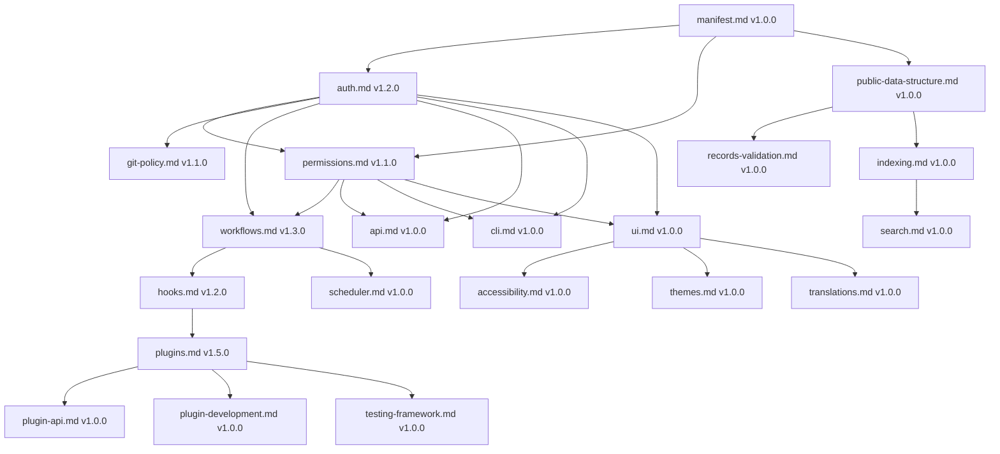
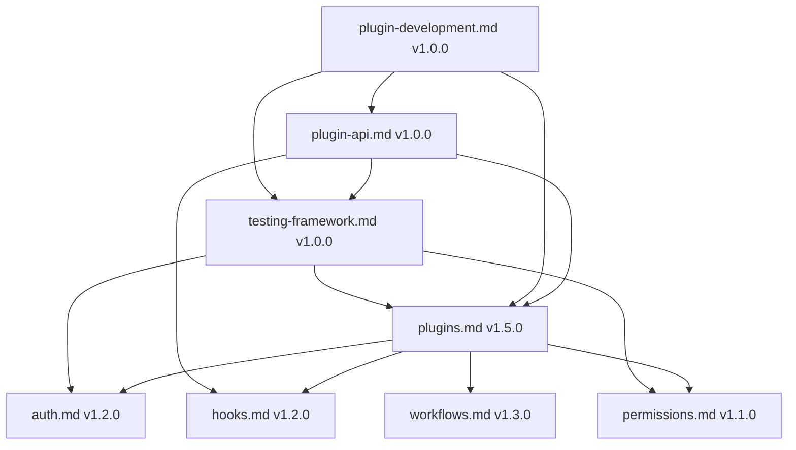

# CivicPress Spec: `version-tracker.md`

---

version: 1.0.0 status: stable created: '2025-07-15' updated: '2025-07-15'
deprecated: false sunset_date: null breaking_changes: [] additions:

- comprehensive version tracking documentation
- dependency management
- compatibility matrices fixes: [] migration_guide: null compatibility:
 min_civicpress: 1.0.0 max_civicpress: 'null' dependencies:
 - 'spec-versioning.md: >=1.0.0' authors:
- Sophie Germain <sophie@civicpress.io> reviewers:
- Ada Lovelace
- Irène Joliot-Curie

---

## Name

Specification Version Tracker & Dependency Manager

## Purpose

Provide a centralized system for tracking all CivicPress specification versions,
dependencies, and compatibility matrices. This enables automated version
validation, dependency resolution, and change impact analysis.

---

## Scope & Responsibilities

Responsibilities:

- Track all spec versions and their relationships
- Validate dependency compatibility
- Generate version reports and matrices
- Identify breaking change impacts
- Manage migration paths and guides

Out of Scope:

- Implementation version management
- Third-party dependency tracking

---

## Inputs & Outputs

| Input | Description |
| ----------------------- | --------------------------------------- |
| Spec files | CivicPress specification markdown files |
| Version metadata | Version numbers, status, and dates |
| Dependency declarations | Spec-to-spec dependency relationships |
| Change requests | Proposed version updates and changes |
| Compatibility rules | Version compatibility constraints |

| Output | Description |
| --------------------- | ------------------------------------- |
| Version matrices | Comprehensive version tracking tables |
| Dependency graphs | Visual dependency relationship maps |
| Compatibility reports | Version compatibility analysis |
| Migration paths | Breaking change migration guides |
| Version analytics | Spec health and adoption metrics |

---

## File/Folder Location

```
.civic/
├── version-tracker.yml # Version tracking configuration
├── version-matrices/ # Version matrix data
│ ├── core-specs.yml
│ ├── plugin-specs.yml
│ └── ui-specs.yml
├── dependency-graphs/ # Dependency visualization data
│ ├── core-dependencies.yml
│ ├── plugin-dependencies.yml
│ └── ui-dependencies.yml
├── compatibility-rules/ # Compatibility constraints
│ ├── core-compatibility.yml
│ ├── plugin-compatibility.yml
│ └── ui-compatibility.yml
└── migration-paths/ # Migration documentation
 ├── breaking-changes.yml
 ├── migration-guides.yml
 └── adoption-tracking.yml

core/
├── version-tracker.ts # Main version tracking logic
├── dependency-resolver.ts # Dependency resolution engine
├── compatibility-checker.ts # Compatibility validation
└── migration-analyzer.ts # Migration path analysis

modules/
├── version-tracker/
│ ├── components/
│ │ ├── VersionMatrix.tsx # Version matrix display
│ │ ├── DependencyGraph.tsx # Dependency visualization
│ │ └── MigrationPaths.tsx # Migration path display
│ ├── hooks/
│ │ └── useVersionTracking.ts # Version tracking data hook
│ └── utils/
│ ├── version-parser.ts # Version parsing utilities
│ └── dependency-analyzer.ts # Dependency analysis
└── ui/
 └── components/
 └── VersionTrackerProvider.tsx # Version tracking context

tests/
├── version-tracker/
│ ├── dependency-resolution.test.ts
│ ├── compatibility-validation.test.ts
│ └── migration-analysis.test.ts
└── integration/
 └── version-tracker-integration.test.ts
```

---

## Current Spec Version Matrix

### Core Specifications

| Spec | Version | Status | Last Updated | Breaking Changes | Dependencies |
| ---------------- | ------- | -------- | ------------ | ---------------- | ------------------------------------------------ |
| `manifest.md` | `1.0.0` | `stable` | `2025-07-03` | `0` | `[]` |
| `auth.md` | `1.2.0` | `stable` | `2025-07-15` | `0` | `[permissions.md >=1.1.0, roles.yml.md >=1.0.0]` |
| `permissions.md` | `1.1.0` | `stable` | `2025-07-15` | `0` | `[auth.md >=1.2.0, workflows.md >=1.3.0]` |
| `git-policy.md` | `1.1.0` | `stable` | `2025-07-05` | `0` | `[auth.md >=1.2.0, permissions.md >=1.1.0]` |
| `workflows.md` | `1.3.0` | `stable` | `2025-07-10` | `0` | `[auth.md >=1.2.0, permissions.md >=1.1.0]` |
| `hooks.md` | `1.2.0` | `stable` | `2025-07-10` | `0` | `[workflows.md >=1.3.0]` |

### Plugin System

| Spec | Version | Status | Last Updated | Breaking Changes | Dependencies |
| ----------------------- | ------- | -------- | ------------ | ---------------- | --------------------------------------------- |
| `plugins.md` | `1.5.0` | `stable` | `2025-07-15` | `0` | `[auth.md >=1.2.0, permissions.md >=1.1.0]` |
| `plugin-api.md` | `1.0.0` | `stable` | `2025-07-15` | `0` | `[plugins.md >=1.5.0, hooks.md >=1.2.0]` |
| `plugin-development.md` | `1.0.0` | `stable` | `2025-07-15` | `0` | `[plugins.md >=1.5.0, plugin-api.md >=1.0.0]` |

### Testing & Quality

| Spec | Version | Status | Last Updated | Breaking Changes | Dependencies |
| ---------------------- | ------- | -------- | ------------ | ---------------- | --------------------------------------- |
| `testing-framework.md` | `1.0.0` | `stable` | `2025-07-15` | `0` | `[plugins.md >=1.5.0, auth.md >=1.2.0]` |

### Security & Compliance

| Spec | Version | Status | Last Updated | Breaking Changes | Dependencies |
| ------------- | ------- | -------- | ------------ | ---------------- | ------------------------------------------- |
| `security.md` | `1.0.0` | `stable` | `2025-07-03` | `0` | `[auth.md >=1.2.0, permissions.md >=1.1.0]` |
| `backup.md` | `1.0.0` | `stable` | `2025-07-03` | `0` | `[storage.md >=1.0.0]` |
| `storage.md` | `1.0.0` | `stable` | `2025-07-03` | `0` | `[]` |

### User Experience

| Spec | Version | Status | Last Updated | Breaking Changes | Dependencies |
| ------------------ | ------- | -------- | ------------ | ---------------- | ------------------------------------------- |
| `ui.md` | `1.0.0` | `stable` | `2025-07-03` | `0` | `[auth.md >=1.2.0, permissions.md >=1.1.0]` |
| `accessibility.md` | `1.0.0` | `stable` | `2025-07-03` | `0` | `[ui.md >=1.0.0]` |
| `themes.md` | `1.0.0` | `stable` | `2025-07-03` | `0` | `[ui.md >=1.0.0]` |
| `translations.md` | `1.0.0` | `stable` | `2025-07-03` | `0` | `[ui.md >=1.0.0]` |

### Data & Records

| Spec | Version | Status | Last Updated | Breaking Changes | Dependencies |
| -------------------------- | ------- | -------- | ------------ | ---------------- | ------------------------------------ |
| `public-data-structure.md` | `1.0.0` | `stable` | `2025-07-03` | `0` | `[manifest.md >=1.0.0]` |
| `records-validation.md` | `1.0.0` | `stable` | `2025-07-03` | `0` | `[public-data-structure.md >=1.0.0]` |
| `indexing.md` | `1.0.0` | `stable` | `2025-07-03` | `0` | `[public-data-structure.md >=1.0.0]` |
| `search.md` | `1.0.0` | `stable` | `2025-07-03` | `0` | `[indexing.md >=1.0.0]` |

### System & Infrastructure

| Spec | Version | Status | Last Updated | Breaking Changes | Dependencies |
| --------------- | ------- | -------- | ------------ | ---------------- | ------------------------------------------- |
| `api.md` | `1.0.0` | `stable` | `2025-07-03` | `0` | `[auth.md >=1.2.0, permissions.md >=1.1.0]` |
| `cli.md` | `1.0.0` | `stable` | `2025-07-03` | `0` | `[auth.md >=1.2.0, permissions.md >=1.1.0]` |
| `deployment.md` | `1.0.0` | `stable` | `2025-07-03` | `0` | `[manifest.md >=1.0.0]` |
| `scheduler.md` | `1.0.0` | `stable` | `2025-07-03` | `0` | `[workflows.md >=1.3.0, hooks.md >=1.2.0]` |

---

## Dependency Graph

### Core Dependencies



### Plugin System Dependencies



---

## Version Validation Rules

### Compatibility Matrix

```yaml
# .civic/version-compatibility.yml
compatibility_rules:
# Core system compatibility
 core_specs:
 auth.md:
 min_version: '1.2.0'
 max_version: null
 required_by:
 - permissions.md
 - git-policy.md
 - workflows.md
 - api.md
 - cli.md
 - ui.md
 - plugins.md

 permissions.md:
 min_version: '1.1.0'
 max_version: null
 required_by:
 - auth.md
 - workflows.md
 - api.md
 - cli.md
 - ui.md
 - plugins.md

 workflows.md:
 min_version: '1.3.0'
 max_version: null
 required_by:
 - hooks.md
 - scheduler.md
 - plugins.md

 hooks.md:
 min_version: '1.2.0'
 max_version: null
 required_by:
 - plugins.md
 - plugin-api.md
 - testing-framework.md

# Plugin system compatibility
 plugin_specs:
 plugins.md:
 min_version: '1.5.0'
 max_version: null
 required_by:
 - plugin-api.md
 - plugin-development.md
 - testing-framework.md

 plugin-api.md:
 min_version: '1.0.0'
 max_version: null
 required_by:
 - plugin-development.md
 - testing-framework.md

# Testing framework compatibility
 testing_specs:
 testing-framework.md:
 min_version: '1.0.0'
 max_version: null
 required_by:
 - plugins.md
 - plugin-development.md
```

### Validation Commands

```bash
# Validate all spec versions
civic spec validate-versions

# Check for version conflicts
civic spec check-conflicts

# Generate compatibility report
civic spec compatibility-report

# Validate dependencies
civic spec validate-dependencies

# Check for breaking changes
civic spec check-breaking-changes

# Generate migration paths
civic spec migration-paths
```

---

## Version Evolution Tracking

### Breaking Change Impact Analysis

```yaml
# Breaking change tracking
breaking_changes:
 auth.md:
 v1.2.0:
 impact:
 - permissions.md: 'Minor - Updated testing patterns'
 - git-policy.md: 'None - No changes required'
 - workflows.md: 'None - No changes required'
 migration_required: false
 migration_guide: null

 permissions.md:
 v1.1.0:
 impact:
 - auth.md: 'None - No changes required'
 - workflows.md: 'Minor - Enhanced testing patterns'
 - api.md: 'None - No changes required'
 migration_required: false
 migration_guide: null

 plugins.md:
 v1.5.0:
 impact:
 - plugin-api.md: 'Minor - Enhanced examples'
 - plugin-development.md: 'Minor - Enhanced examples'
 - testing-framework.md: 'Minor - Enhanced patterns'
 migration_required: false
 migration_guide: null
```

### Version Adoption Tracking

```yaml
# Version adoption metrics
adoption_metrics:
 auth.md:
 v1.2.0:
 adoption_rate: '100%'
 breaking_changes: 0
 migration_guides: 0
 deprecations: 0

 permissions.md:
 v1.1.0:
 adoption_rate: '100%'
 breaking_changes: 0
 migration_guides: 0
 deprecations: 0

 plugins.md:
 v1.5.0:
 adoption_rate: '100%'
 breaking_changes: 0
 migration_guides: 0
 deprecations: 0
```

---

## Migration Path Management

### Automated Migration Detection

```typescript
// Migration path detection
export class MigrationPathDetector {
 async detectMigrationPaths(
 fromVersion: string,
 toVersion: string
 ): Promise<MigrationPath[]> {
 const paths: MigrationPath[] = [];

 // Check for breaking changes
 const breakingChanges = await this.getBreakingChanges(
 fromVersion,
 toVersion
 );

 for (const change of breakingChanges) {
 const path = await this.generateMigrationPath(change);
 paths.push(path);
 }

 return paths;
 }

 private async generateMigrationPath(
 breakingChange: BreakingChange
 ): Promise<MigrationPath> {
 return {
 spec: breakingChange.spec,
 fromVersion: breakingChange.fromVersion,
 toVersion: breakingChange.toVersion,
 changes: breakingChange.changes,
 migrationSteps: await this.generateMigrationSteps(breakingChange),
 estimatedEffort: this.estimateMigrationEffort(breakingChange),
 automated: this.canAutomateMigration(breakingChange),
 };
 }
}
```

### Migration Path Examples

```yaml
# Example migration paths
migration_paths:
 plugins.md:
 v1.4.0_to_v1.5.0:
 breaking_changes: 0
 migration_steps: []
 automated: true
 effort: 'Low'
 duration: '5 minutes'

 v1.3.0_to_v1.4.0:
 breaking_changes: 0
 migration_steps: []
 automated: true
 effort: 'Low'
 duration: '5 minutes'

 v1.2.0_to_v1.3.0:
 breaking_changes: 0
 migration_steps: []
 automated: true
 effort: 'Low'
 duration: '5 minutes'
```

---

## Version Analytics

### Spec Health Metrics

```yaml
# Spec health tracking
spec_health:
 total_specs: 25
 stable_specs: 25
 deprecated_specs: 0
 sunset_specs: 0

 version_distribution:
 v1.0.0: 15
 v1.1.0: 3
 v1.2.0: 2
 v1.3.0: 2
 v1.5.0: 3

 breaking_changes:
 total: 0
 this_month: 0
 this_quarter: 0

 dependencies:
 total_dependencies: 45
 circular_dependencies: 0
 version_conflicts: 0
```

### Change Impact Analysis

```yaml
# Change impact tracking
change_impact:
 auth.md_v1.2.0:
 affected_specs: 8
 breaking_changes: 0
 migration_guides: 0
 adoption_rate: '100%'

 permissions.md_v1.1.0:
 affected_specs: 6
 breaking_changes: 0
 migration_guides: 0
 adoption_rate: '100%'

 plugins.md_v1.5.0:
 affected_specs: 3
 breaking_changes: 0
 migration_guides: 0
 adoption_rate: '100%'
```

---

## Testing & Validation

### Version Validation Testing

```typescript
// Test version compatibility validation
export class VersionValidationTests {
 async testVersionCompatibility(): Promise<TestResult[]> {
 return [
 await this.testValidVersionRanges(),
 await this.testInvalidVersionRanges(),
 await this.testBreakingChangeDetection(),
 await this.testDependencyConflictResolution(),
 ];
 }

 private async testValidVersionRanges(): Promise<TestResult> {
 const testCases = [
 { spec: 'auth.md', version: '1.2.0', expected: true },
 { spec: 'permissions.md', version: '1.1.0', expected: true },
 { spec: 'plugins.md', version: '1.5.0', expected: true },
 ];

 const results = await Promise.all(
 testCases.map(tc => this.validateVersion(tc.spec, tc.version))
 );

 const passed = results.every(r => r === true);
 return {
 test: 'Valid Version Ranges',
 passed,
 details: { testCases, results },
 };
 }

 private async testBreakingChangeDetection(): Promise<TestResult> {
 const breakingChanges = await this.detectBreakingChanges('auth.md', '1.1.0', '1.2.0');
 const hasBreakingChanges = breakingChanges.length > 0;

 return {
 test: 'Breaking Change Detection',
 passed: !hasBreakingChanges, // Should not have breaking changes
 details: { breakingChanges },
 };
 }
}
```

### Dependency Resolution Testing

```typescript
// Test dependency conflict resolution
export class DependencyResolutionTests {
 async testDependencyConflicts(): Promise<TestResult[]> {
 return [
 await this.testCircularDependencyDetection(),
 await this.testVersionConflictResolution(),
 await this.testDependencyGraphValidation(),
 await this.testMigrationPathGeneration(),
 ];
 }

 private async testCircularDependencyDetection(): Promise<TestResult> {
 const circularDeps = await this.detectCircularDependencies();
 const hasCircularDeps = circularDeps.length > 0;

 return {
 test: 'Circular Dependency Detection',
 passed: !hasCircularDeps,
 details: { circularDependencies: circularDeps },
 };
 }

 private async testVersionConflictResolution(): Promise<TestResult> {
 const conflicts = await this.detectVersionConflicts();
 const resolvedConflicts = await this.resolveVersionConflicts(conflicts);

 return {
 test: 'Version Conflict Resolution',
 passed: resolvedConflicts.every(c => c.resolved),
 details: { conflicts, resolvedConflicts },
 };
 }
}
```

### Migration Path Testing

```typescript
// Test migration path generation and validation
export class MigrationPathTests {
 async testMigrationPaths(): Promise<TestResult[]> {
 return [
 await this.testMigrationPathGeneration(),
 await this.testMigrationPathValidation(),
 await this.testAutomatedMigration(),
 await this.testMigrationRollback(),
 ];
 }

 private async testMigrationPathGeneration(): Promise<TestResult> {
 const migrationPath = await this.generateMigrationPath(
 'plugins.md',
 '1.4.0',
 '1.5.0'
 );

 return {
 test: 'Migration Path Generation',
 passed: migrationPath.steps.length > 0,
 details: { migrationPath },
 };
 }

 private async testAutomatedMigration(): Promise<TestResult> {
 const migration = await this.performAutomatedMigration(
 'auth.md',
 '1.1.0',
 '1.2.0'
 );

 return {
 test: 'Automated Migration',
 passed: migration.success,
 details: { migration },
 };
 }
}
```

### Integration Testing

```typescript
// Test version tracker integration with other systems
export class IntegrationTests {
 async testSystemIntegration(): Promise<TestResult[]> {
 return [
 await this.testSpecValidationIntegration(),
 await this.testCLIIntegration(),
 await this.testAPIIntegration(),
 await this.testUIIntegration(),
 ];
 }

 private async testSpecValidationIntegration(): Promise<TestResult> {
 const validationResult = await this.validateAllSpecs();

 return {
 test: 'Spec Validation Integration',
 passed: validationResult.allValid,
 details: { validationResult },
 };
 }

 private async testCLIIntegration(): Promise<TestResult> {
 const cliCommands = [
 'civic spec validate-versions',
 'civic spec check-conflicts',
 'civic spec compatibility-report',
 ];

 const results = await Promise.all(
 cliCommands.map(cmd => this.executeCLICommand(cmd))
 );

 return {
 test: 'CLI Integration',
 passed: results.every(r => r.success),
 details: { cliCommands, results },
 };
 }
}
```

### Performance Testing

```typescript
// Test version tracker performance
export class PerformanceTests {
 async testPerformance(): Promise<TestResult[]> {
 return [
 await this.testLargeDependencyGraph(),
 await this.testVersionMatrixGeneration(),
 await this.testCompatibilityAnalysis(),
 await this.testMigrationPathCalculation(),
 ];
 }

 private async testLargeDependencyGraph(): Promise<TestResult> {
 const startTime = performance.now();
 const graph = await this.generateDependencyGraph(1000); // 1000 specs
 const duration = performance.now() - startTime;

 return {
 test: 'Large Dependency Graph',
 passed: duration < 5000, // Should complete within 5 seconds
 details: { duration, graphSize: graph.nodes.length },
 };
 }
}
```

---

## Security & Trust Considerations

### Version Security

- All spec versions must be cryptographically signed
- Version history must be immutable and tamper-evident
- Breaking changes require explicit approval and migration planning
- Version compatibility must be thoroughly validated

### Change Management

- All version changes must be reviewed by multiple team members
- Breaking changes require community consultation
- Version compatibility must be tested across all dependent specs
- Migration tools must be provided for breaking changes

### Audit Trail

- Complete version history must be maintained
- All version updates must be logged with timestamps
- Dependency changes must be tracked and validated
- Breaking change impact must be assessed and documented

---

## Related Specs

- [`spec-versioning.md`](./spec-versioning.md) — Versioning system and change
 management
- [`manifest.md`](./manifest.md) — CivicPress manifest versioning
- [`git-policy.md`](./git-policy.md) — Git-based version control
- [`workflows.md`](./workflows.md) — Change management workflows

---

## ️ Future Enhancements

- Automated version compatibility checking
- Dependency impact analysis tools
- Automated migration script generation
- Version conflict resolution systems
- Spec evolution prediction models
- Real-time version monitoring and alerts

---

## History

- Drafted: 2025-07-04
- Last updated: 2025-07-15
