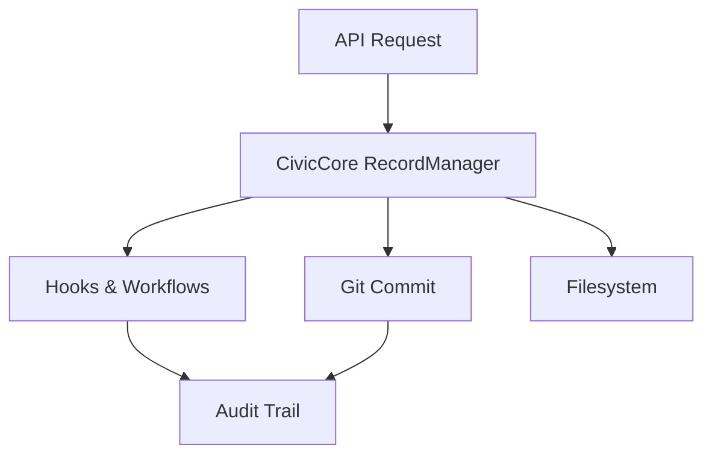

# CivicPress API

## CivicPress API-to-Core Integration

All record operations (create, update, archive/delete, get, list) are now fully
integrated with the CivicPress **CivicCore** platform. This means:

- **Every API call** for records goes through the CivicCore `RecordManager`.
- **Hooks and workflows** are triggered for audit trails, notifications, and
  business logic.
- **Git commits** are automatically created for every change, ensuring a full
  audit trail.
- **Permission checks** are enforced via the workflow configuration (role-based
  access).
- **Logical delete** (archive) is used—records are never physically deleted, but
  moved to the archive folder and marked as archived.

### High-Level Flow



---

## Endpoints

### Create Record

- Triggers: `record:created` hook, Git commit, permission check
- Fails if role is not allowed to create the record type

### Update Record

- Triggers: `record:updated` hook, Git commit, permission check
- Fails if role is not allowed to edit the record type

### Archive (Delete) Record

- Triggers: `record:archived` hook, Git commit, permission check
- Moves the record to the archive folder, updates status and metadata
- Fails if role is not allowed to delete the record type

### Get/List Records

- Reads from the CivicCore-managed records directory
- Returns metadata and content

---

## Permissions & Roles

- API keys are mapped to roles (`admin`, `clerk`, `council`, `public`)
- Permissions are enforced via the workflow config (`data/.civic/workflows.yml`)
- Example error response for insufficient permissions:

```json
{
  "error": {
    "message": "Failed to create record",
    "details": "Permission denied: Role 'public' cannot create records of type 'bylaw'"
  }
}
```

---

## Logical Delete (Archive)

- DELETE requests do **not** remove files, but move them to `archive/<type>/`
  and update their status to `archived`.
- The API response includes the archive location and timestamp.

---

## Example Record Lifecycle

1. **Create**: POST `/api/v1/records` → triggers hooks, Git commit, file created
2. **Update**: PUT `/api/v1/records/:id` → triggers hooks, Git commit, file
   updated
3. **Archive**: DELETE `/api/v1/records/:id` → triggers hooks, Git commit, file
   moved to archive

---

## See Also

- [CivicCore RecordManager Documentation](../../core/README.md)
- [Workflow Configuration](../../data/.civic/workflows.yml)
- See [Hook System Spec](../../docs/specs/hooks.md) for details.

---

## Quick Start

### Prerequisites

- Node.js 18+
- pnpm
- CivicPress core initialized with data directory

### Installation

```bash
# From project root
cd modules/api
pnpm install
```

### Development

```bash
# Start API server in development mode
pnpm run dev

# Build for production
pnpm run build

# Start production server
pnpm start
```

### Development Environment Variables

- `CIVIC_DATA_DIR` - Path to CivicPress data directory (defaults to
  `../../data`)
- `PORT` - API server port (defaults to 3000)
- `HOST` - API server host (defaults to localhost)

## API Reference

### Base URL

```
http://localhost:3000
```

### Authentication

Currently using API key authentication (placeholder). Set `X-API-Key` header:

```bash
curl -H "X-API-Key: your-api-key" http://localhost:3000/api/v1/records
```

<!-- markdownlint-disable MD024 -->

### API Endpoints

#### System Health Check

```http
GET /health
```

**Response:**

```json
{
  "status": "healthy",
  "timestamp": "2025-07-09T02:32:59.834Z",
  "uptime": 13.434363833,
  "version": "1.0.0",
  "environment": "development"
}
```

#### Records API

##### List All Records

```http
GET /api/v1/records
```

**Query Parameters:**

- `type` - Filter by record type (bylaw, policy, proposal, resolution)
- `status` - Filter by status (draft, proposed, approved, active, archived)
- `limit` - Number of records per page (default: 10)
- `offset` - Number of records to skip (default: 0)

**Example:**

```bash
curl "http://localhost:3000/api/v1/records?type=bylaw&status=active&limit=5"
```

**Response:**

```json
{
  "success": true,
  "data": {
    "records": [
      {
        "id": "article-001---animal-control",
        "title": "Article 001 - Animal Control",
        "type": "bylaw",
        "status": "active",
        "content": "All dogs must be leashed in public parks at all times.",
        "hasUnpublishedChanges": true,
        "metadata": {
          "author": "City Council",
          "created": "2024-01-01",
          "updated": "2024-01-01",
          "version": "1.0.0"
        },
        "path": "records/bylaw/article-001---animal-control.md",
        "created_at": "2024-01-01T00:00:00.000Z",
        "updated_at": "2024-01-01T00:00:00.000Z"
      }
    ],
    "nextCursor": "article-002---parking",
    "hasMore": true,
    "total": 40
  }
}
```

**Note:** The `hasUnpublishedChanges` field is only included for authenticated
users with `records:edit` permission. It indicates whether a draft version
exists for the published record. Public users will not see this field.

#### Records API

##### Get Single Record

```http
GET /api/v1/records/{id}
GET /api/v1/records/{id}?edit=true
```

**Path Parameters:**

- `id` - Record ID (filename without extension)

**Query Parameters:**

- `type` - Record type (optional, for faster lookup)
- `edit` - When set to `"true"` and user is authenticated with `records:edit`
  permission, returns draft version if it exists. Otherwise, always returns
  published version. Defaults to `false` (view mode).

**Behavior:**

- **View Mode (default or `edit=false`)**: Always returns the published record
  from the `records` table. For authenticated users with `records:edit`
  permission, includes `hasUnpublishedChanges` flag if a draft exists.
- **Edit Mode (`edit=true`)**: For authenticated users with `records:edit`
  permission, returns the draft version if it exists, otherwise falls back to
  the published version. For public users or users without permission, returns
  published version regardless.

**Example - View Mode (Published Record):**

```bash
curl "http://localhost:3000/api/v1/records/article-001---animal-control" \
  -H "Authorization: Bearer <token>"
```

**Example - Edit Mode (Draft if Available):**

```bash
curl "http://localhost:3000/api/v1/records/article-001---animal-control?edit=true" \
  -H "Authorization: Bearer <token>"
```

**Response - View Mode (with unpublished changes):**

```json
{
  "success": true,
  "data": {
    "id": "article-001---animal-control",
    "title": "Article 001 - Animal Control",
    "type": "bylaw",
    "status": "active",
    "content": "All dogs must be leashed in public parks at all times.",
    "isDraft": false,
    "hasUnpublishedChanges": true,
    "metadata": {
      "author": "City Council",
      "created": "2024-01-01",
      "updated": "2024-01-01",
      "version": "1.0.0"
    },
    "path": "records/bylaw/article-001---animal-control.md"
  }
}
```

**Response - Edit Mode (Draft):**

```json
{
  "success": true,
  "data": {
    "id": "article-001---animal-control",
    "title": "Article 001 - Animal Control (Updated)",
    "type": "bylaw",
    "status": "draft",
    "markdownBody": "# Article 001 - Animal Control\n\nAll dogs must be leashed in public parks at all times.\n\nNew draft content...",
    "isDraft": true,
    "workflowState": "under_review",
    "metadata": {
      "author": "City Council",
      "created": "2024-01-01",
      "updated": "2024-12-09",
      "version": "1.0.0"
    },
    "created_at": "2024-01-01T00:00:00.000Z",
    "updated_at": "2024-12-09T15:30:00.000Z",
    "last_draft_saved_at": "2024-12-09T15:30:00.000Z"
  }
}
```

**Note:** The `hasUnpublishedChanges` field is only included for authenticated
users with `records:edit` permission. Public users will not see this field.

##### Create New Record

```http
POST /api/v1/records
```

**Request Body:**

```json
{
  "title": "New Bylaw Title",
  "type": "bylaw",
  "content": "# New Bylaw\n\nContent goes here...",
  "template": "default",
  "role": "clerk",
  "metadata": {
    "chapter": "03",
    "article": "001"
  }
}
```

**Required Fields:**

- `title` - Record title
- `type` - Record type (bylaw, policy, proposal, resolution)

**Optional Fields:**

- `content` - Markdown content (defaults to template)
- `template` - Template to use (defaults to type/default)
- `role` - User role for permissions
- `metadata` - Additional metadata

**Example:**

```bash
curl -X POST http://localhost:3000/api/v1/records \
  -H "Content-Type: application/json" \
  -H "X-API-Key: clerk" \
  -d '{
    "title": "API Test Record",
    "type": "bylaw",
    "content": "# API Test Record\n\nThis is a test record.",
    "role": "clerk"
  }'
```

**Response:**

```json
{
  "id": "api-test-record",
  "title": "API Test Record",
  "type": "bylaw",
  "status": "draft",
  "content": "# API Test Record\n\nThis is a test record.",
  "metadata": {
    "title": "API Test Record",
    "type": "bylaw",
    "status": "draft",
    "author": "clerk",
    "version": "1.0.0",
    "created": "2025-07-09T02:33:24.902Z",
    "updated": "2025-07-09T02:33:24.902Z"
  },
  "path": "records/bylaw/api-test-record.md"
}
```

##### Update Existing Record

```http
PUT /api/v1/records/{id}
```

**Path Parameters:**

- `id` - Record ID

**Request Body:**

```json
{
  "title": "Updated Title",
  "content": "# Updated Content\n\nNew content here...",
  "status": "proposed",
  "metadata": {
    "updatedBy": "council",
    "reviewDate": "2025-08-01"
  }
}
```

**Example:**

```bash
curl -X PUT http://localhost:3000/api/v1/records/api-test-record \
  -H "Content-Type: application/json" \
  -H "X-API-Key: council" \
  -d '{
    "status": "proposed",
    "content": "# Updated API Test Record\n\nThis record has been updated."
  }'
```

##### Search Records

```http
GET /api/v1/search
```

**Query Parameters:**

- `q` (required) - Search query string
- `type` - Filter by record type (optional)
- `limit` - Number of results per page (default: 20, max: 300)
- `cursor` - Pagination cursor (optional)

**Example:**

```bash
curl "http://localhost:3000/api/v1/search?q=animal control&type=bylaw" \
  -H "Authorization: Bearer <token>"
```

**Response:**

```json
{
  "success": true,
  "data": {
    "results": [
      {
        "id": "article-001---animal-control",
        "title": "Article 001 - Animal Control",
        "type": "bylaw",
        "status": "active",
        "content": "All dogs must be leashed...",
        "hasUnpublishedChanges": true,
        "metadata": {
          "author": "City Council",
          "created": "2024-01-01"
        },
        "path": "records/bylaw/article-001---animal-control.md",
        "created_at": "2024-01-01T00:00:00.000Z",
        "updated_at": "2024-01-01T00:00:00.000Z"
      }
    ],
    "nextCursor": "article-002---parking",
    "hasMore": true,
    "query": "animal control"
  }
}
```

**Note:** The `hasUnpublishedChanges` field is only included for authenticated
users with `records:edit` permission. Public users will not see this field.

##### Archive Record (Logical Delete)

```http
DELETE /api/v1/records/{id}
```

**Path Parameters:**

- `id` - Record ID

**Note:** This endpoint performs a **logical delete** - the record is moved to
the archive folder rather than being permanently deleted, maintaining the audit
trail as required by CivicPress specifications.

**Example:**

```bash
curl -X DELETE http://localhost:3000/api/v1/records/api-test-record \
  -H "X-API-Key: admin"
```

**Response:**

```json
{
  "message": "Record api-test-record archived successfully",
  "archivedAt": "2025-07-09T02:35:12.123Z",
  "archiveLocation": "archive/bylaw/api-test-record.md",
  "note": "Record has been moved to archive and is no longer active"
}
```

## Authentication & Authorization

### Current Implementation

- API key authentication via `X-API-Key` header
- Role-based permissions for record operations
- Workflow validation for status transitions

### Roles & Permissions

| Role      | Create                    | Read | Update | Archive | Status Transitions  |
| --------- | ------------------------- | ---- | ------ | ------- | ------------------- |
| `clerk`   | bylaw, policy, resolution | all  | all    | none    | draft → proposed    |
| `council` | bylaw, policy, resolution | all  | all    | all     | proposed → approved |
| `public`  | none                      | all  | none   | none    | none                |

### Status Workflow

```
draft → proposed → reviewed → approved → archived
```

## Development Guide

### Project Structure

```
modules/api/
├── src/
│   ├── index.ts              # Main API server
│   ├── routes/               # API route handlers
│   │   ├── records.ts        # Records CRUD
│   │   ├── templates.ts      # Template management
│   │   ├── workflows.ts      # Workflow operations
│   │   ├── hooks.ts          # Hook management
│   │   ├── export.ts         # Export operations
│   │   ├── import.ts         # Import operations
│   │   ├── search.ts         # Search functionality
│   │   └── health.ts         # Health check
│   ├── services/             # Business logic
│   │   └── records-service.ts # Record operations
│   └── middleware/           # Express middleware
│       ├── auth.ts           # Authentication
│       ├── error-handler.ts  # Error handling
│       └── not-found.ts      # 404 handler
├── package.json
└── README.md
```

### Adding New Endpoints

1. Create route handler in `src/routes/`
2. Add validation using express-validator
3. Implement service layer in `src/services/`
4. Add to main router in `src/index.ts`

### Testing

```bash
# Run tests
pnpm test

# Run tests in watch mode
pnpm test:watch

# Run tests with coverage
pnpm test:coverage
```

## Configuration

### Server Options

```typescript
interface ApiServerOptions {
  port?: number;              // Default: 3000
  host?: string;              // Default: localhost
  corsOrigin?: string;        // Default: *
  rateLimitWindowMs?: number; // Default: 15 minutes
  rateLimitMax?: number;      // Default: 100 requests
  enableAuth?: boolean;       // Default: false
  dataDir?: string;           // Default: ../../data
}
```

### Rate Limiting

- 100 requests per 15 minutes per IP
- Configurable via options

### CORS

- Configurable origins
- Credentials supported
- Default: allow all origins

## Deployment

### Production Build

```bash
# Build the API
cd modules/api
pnpm run build

# Start production server
pnpm start
```

### Docker (Coming Soon)

```dockerfile
FROM node:18-alpine
WORKDIR /app
COPY package*.json ./
RUN npm ci --only=production
COPY dist ./dist
EXPOSE 3000
CMD ["node", "dist/index.js"]
```

### Environment Variables

```bash
# Required
CIVIC_DATA_DIR=/path/to/civicpress/data

# Optional
PORT=3000
HOST=0.0.0.0
NODE_ENV=production
```

## Monitoring

### Health Check

- Endpoint: `GET /health`
- Returns server status, uptime, version
- Use for load balancer health checks

### Logging

- Morgan HTTP request logging
- Structured error logging
- Hook system events logged

### Metrics (Planned)

- Request/response times
- Error rates
- Record operation counts
- User activity metrics

## Integration Examples

### JavaScript/Node.js

```javascript
const API_BASE = 'http://localhost:3000/api/v1';

// List records
const response = await fetch(`${API_BASE}/records?type=bylaw&status=active`);
const records = await response.json();

// Create record
const newRecord = await fetch(`${API_BASE}/records`, {
  method: 'POST',
  headers: {
    'Content-Type': 'application/json',
    'X-API-Key': 'clerk'
  },
  body: JSON.stringify({
    title: 'New Bylaw',
    type: 'bylaw',
    content: '# New Bylaw\n\nContent...'
  })
});
```

### Python

```python
import requests

API_BASE = 'http://localhost:3000/api/v1'
HEADERS = {'X-API-Key': 'clerk'}

# List records
response = requests.get(f'{API_BASE}/records', headers=HEADERS)
records = response.json()

# Create record
new_record = requests.post(f'{API_BASE}/records',
    headers={**HEADERS, 'Content-Type': 'application/json'},
    json={
        'title': 'New Bylaw',
        'type': 'bylaw',
        'content': '# New Bylaw\n\nContent...'
    }
)
```

### cURL

```bash
# List all records
curl "http://localhost:3000/api/v1/records"

# Create new record
curl -X POST http://localhost:3000/api/v1/records \
  -H "Content-Type: application/json" \
  -H "X-API-Key: clerk" \
  -d '{"title": "Test", "type": "bylaw"}'

# Update record
curl -X PUT http://localhost:3000/api/v1/records/test \
  -H "Content-Type: application/json" \
  -H "X-API-Key: council" \
  -d '{"status": "proposed"}'
```

## Troubleshooting

### Common Issues

#### 1. CivicPress Config Not Found

```bash
# Ensure data directory exists and has config
ls data/.civic/config.yml

# Set environment variable
export CIVIC_DATA_DIR=/path/to/data
```

#### 2. Permission Denied

- Check user role has required permissions
- Verify API key is valid
- Check workflow configuration

#### 3. Record Not Found

- Verify record ID (filename without extension)
- Check record exists in data directory
- Ensure correct record type

### Debug Mode

```bash
# Enable debug logging
DEBUG=civicpress:* pnpm run dev
```

### Logs

- Check console output for error messages
- Review hook system logs
- Monitor rate limiting headers

## Changelog

### v1.0.0 (2025-07-09)

- Initial API implementation
- Records CRUD operations
- CivicPress core integration
- Role-based permissions
- Workflow validation
- Health check endpoint
- Rate limiting and security

## Contributing

1. Fork the repository
2. Create feature branch
3. Add tests for new functionality
4. Ensure all tests pass
5. Submit pull request

## License

MIT License - see LICENSE file for details.
